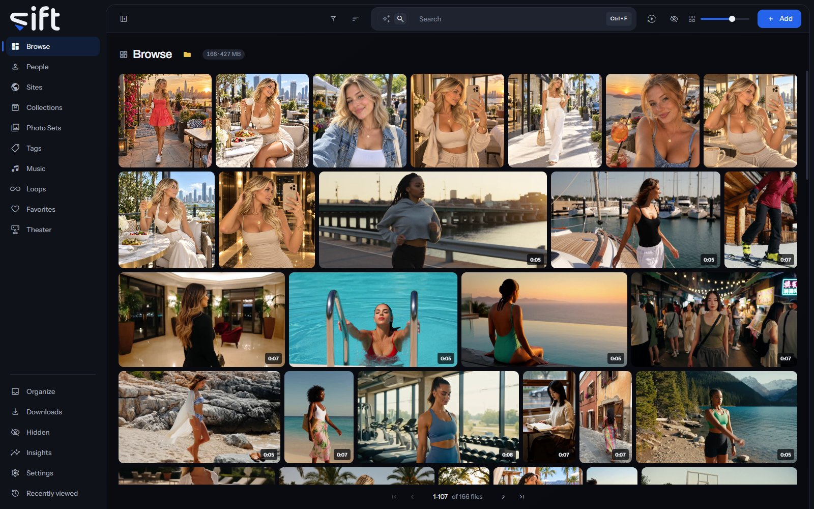

<h1 align="center">
  <picture>
    <source media="(prefers-color-scheme: dark)" srcset="frontend/static/brand/lockup-dark.svg">
    
  </picture>
   
  
</h1>

  
  
  
  
  
  
  
  
  

Sift is a feature-rich, intelligent media manager that lets you browse, download, watch, and
organize your content. It's especially useful for bringing together disorganized collections with
little to no structure, through enrichment like facial recognition and automatic metadata tagging.
Its split-screen player, Theater, plays up to nine videos at the same time in a choice of
layouts. Sift is in early development.

> **Note:** Sift reads your media and changes a file only when you confirm, but keep your own
> backup of your files: a Sift backup holds Sift's records, never your media.

## Documentation

[Sift's documentation](https://nuvibes.github.io/sift/) covers installing Sift, every screen in the
order the app shows it, and every setting. Start there for anything about using Sift:

- **Get started**: install Sift, create your Sift admin account, add your folders and make a first
  download.
- **Your library**: one page for each place in the sidebar, from Browse to Insights.
- **Settings**: one page for each section of Settings, with every row's path and default.
- **Help**: where to ask a question or report a bug.

Ask a question or report a bug in [this repository's issues](https://github.com/nuvibes/sift/issues),
or talk with other people who use Sift on [Sift's Discord](https://discord.gg/VjHQDA3kSw).

## What Sift does

- **Indexes your folders where they are.** A scan reads your files and keeps thumbnails and previews
  apart from them. Moving, renaming and deleting happen only after you confirm.
- **Downloads from a link.** Sift runs yt-dlp and gallery-dl for you, and can send a Site's
  downloads through a WireGuard tunnel with its own tunnel client.
- **Recognizes the people in your files.** Faces uses the InsightFace models, or a pair with a
  permissive license, on this device only.
- **Searches by what a picture shows.** Smart Search finds files from a few words you type, with
  SigLIP-2.
- **Reads a Site's watermark.** Watermarks reads the address burned into a picture with PP-OCRv4 and
  adds the file to that Site.
- **Names songs.** Music compares the sound of your files with Chromaprint, and names a song with
  AcoustID when you turn that on.
- **Fills in details from stash-boxes.** Sift looks up your files on StashDB, FansDB and PMVStash
  when you add a box and turn on lookups.
- **Shares only what you choose.** Each User sees what you share with them, and Hidden keeps files
  out of sight until you unlock it.

Sift downloads no model until you turn on the feature that needs it.
[docs/model-licences.md](docs/model-licences.md) has each model's license and what it was trained
on.

## Install

Sift is a desktop app for 64-bit Windows. Download the installer, the file ending in
`-x64-setup.exe`, from the [latest release](https://github.com/nuvibes/sift/releases/latest). It
installs for the person signed in to Windows and needs no administrator rights.
[Step 1: Install Sift](https://nuvibes.github.io/sift/get-started/install-sift/) walks through it.

Each release is signed. [SECURITY.md](SECURITY.md#verifying-a-release) shows how to check a
download, and Sift checks every update the same way before it installs it.

## Contributing

[CONTRIBUTING.md](CONTRIBUTING.md) covers building Sift from source, the checks every change
runs, and how to write a commit. [ARCHITECTURE.md](ARCHITECTURE.md) sets out how the code is put
together.

## Security

Report a vulnerability privately, never as a public issue. [SECURITY.md](SECURITY.md) has the way
to report and what Sift is built to protect.

## License

Sift is licensed under AGPL-3.0-or-later; see [LICENSE](LICENSE). [NOTICE](NOTICE) lists the tools
the installer carries and their licenses.
