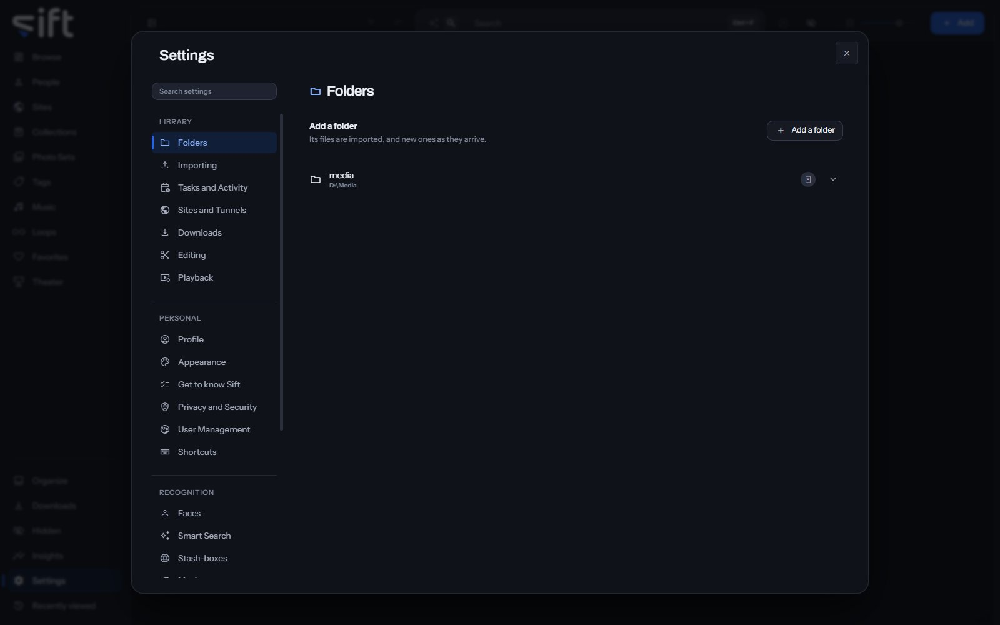

Sift shows the files in the folders you add, and reads each folder where it is. To add one, open [Settings > Folders](/settings/library) and click **Add a folder**.

A folder can be on your computer, on another drive, or on a network share Windows can already open. Sift never moves, renames or deletes a file there unless you ask it to.

## Add a folder

1. In [Settings > Folders](/settings/library), click **Add a folder**.
2. In the Sift app, choose the folder in Windows' own folder window. In a browser, click through the list to the folder you want, then click **Add folder**.
3. Sift imports the folder's files, and new ones as they arrive.

In a browser, the list starts at **Folders Sift already has**. Click **Browse this device** to see the drives of the device Sift runs on, and **Back to the folders Sift has** to return.

> **Note:** A folder Sift can't write in still works. Sift can read everything in it, and can't delete or move anything there.

## Your first folder

When your library has no folders, Browse shows **Add a folder** in the middle of the screen. A folder added there isn't read until you choose to scan it. Browse then says **Sift has your folders and hasn't read them yet.** and offers a choice:

- **Scan now**: every file in your folders is read now. On a large library this can take hours, and your computer may feel slower while it runs.
- **Run during quiet hours**: the scan waits until quiet hours start, which you set in [Settings > Tasks and Activity > Quiet hours](/settings/tasks#tasks.quiet-hours).

After your first folder is added, Sift offers to create a **Download folder** for the files you download. Click **Create this folder**, **Choose another** or **Skip**. [Step 4: Your first download](/get-started/your-first-download/#where-a-download-goes) says how to change it later.

## A big first import

Sift counts every folder you add first, so Activity can say how many files are left. While a folder of 2,000 files or more on a network share is still being scanned, its files are read first. The tasks that wait say **Waiting for the scan to finish.** Once the scan ends, each file's thumbnail, fingerprint, face scan and Smart Search follow its read.

## A folder's menu

Right-click a folder in the list to open its menu:

- **Scan now**: reads the files in this folder again, and nothing more.
- **It moved**: appears when a folder isn't answering, so you can tell Sift where it went.
- **Auto-enrich this folder**: asks your stash-boxes about each file in the folder. An exact match is filled in straight away, and anything less certain waits in Organize.
- **Hide** or **Unhide**: moves the folder into Hidden, or brings it back.
- **Sharing**: chooses the Users who see the folder.
- **Visibility**: shows who can reach the folder, and through what.
- **Don't enrich** or **Allow enrichment**: keeps the folder's files from being looked up anywhere outside your computer, or lets them be looked up again.
- **Don't swap** or **Allow swapping**: keeps the folder's files out of a swap with another Sift, or lets them be offered again.
- **Remove**: Sift forgets what's in the folder. Your files aren't moved or deleted, and adding the folder again within thirty days brings everything back.
