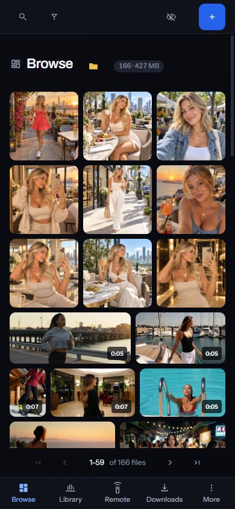

Sift opens in a browser on any device on your home network, and in the Sift app on another computer. To let other devices in, turn on [Settings > General > Share this library on my network](/settings/general#privacy.network_sharing) in the Sift app on the computer that holds your library.



Everyone signs in with a username and password, and a guest sees only what you share with them. The connection on your network isn't encrypted, so use it on a network you trust. For an encrypted connection, reach the computer Sift runs on through a VPN into your home network.

## Share your library

1. In the Sift app on the computer that holds your library, open [Settings > General](/settings/general).
2. Under **Network sharing**, turn on **Share this library on my network**. Sift restarts, which takes a few seconds.
3. Click **Open the firewall port**, and allow the prompt Windows shows.
4. Under **Address**, click **Copy**.

**Network sharing** is in the Sift app only, because it changes how Sift starts on that computer. Sift opens only its own port, and only on private networks.

## When another device can't connect

Windows Firewall blocks other devices without a message, so the other device waits and then gives up. That looks like a wrong address, and the firewall is almost always the reason. After you click **Open the firewall port**, Settings says **Windows lets your other devices reach Sift**.

If Windows treats your network as public, the rule doesn't reach it. Mark your own network as private in Windows. Otherwise, click **Open port on public networks**, which lets any device on that network try to reach Sift.

If the button can't change the firewall, open Windows PowerShell as administrator on the computer that holds your library and run:

```powershell
New-NetFirewallRule -DisplayName "Sift" -Direction Inbound -LocalPort 5171 -Protocol TCP -Action Allow -Profile Private -RemoteAddress LocalSubnet
```

The rule stays until you remove it, even if you uninstall Sift. To remove it, run `Remove-NetFirewallRule -DisplayName "Sift"` the same way.

## Your phone or tablet

Open the address you copied in your phone's browser, and sign in. On a phone, Sift's bar along the bottom holds:

- **Browse**: every file you can see.
- **Library**: People, Sites, Collections, Photo Sets and the rest of the places in the sidebar.
- **Remote**: controls a video or a Theater wall open in the Sift app on your computer.
- **Downloads**: paste a link to download, for an admin.
- **More**: Settings, and signing out.

## Another computer

On another Windows computer, [install Sift](/get-started/install-sift/#run-the-installer) and choose **Another device** when it asks how Sift runs. On **Which computer is your library on?**, paste the address and click **Connect**. The window opens the library on the other computer, and remembers the address for next time.

Settings in that window shows **Firewall** for the computer that holds your library. Its **Open the firewall port** button shows Windows' prompt on that computer, and you approve it there.
