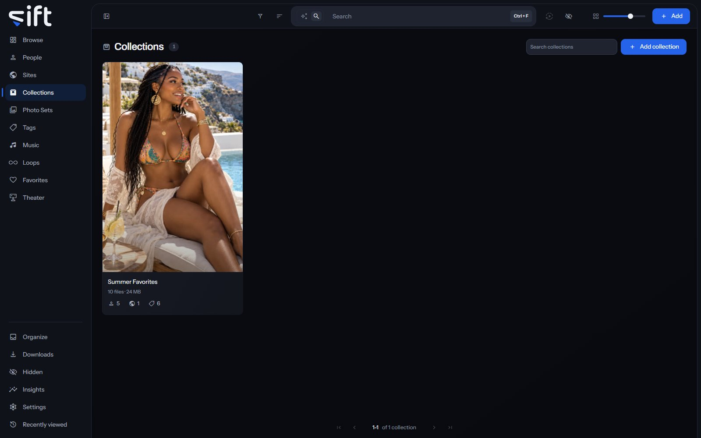

Collections holds the groups of files you put together yourself, each in the order you arrange it. To open it, click [Collections](/collections) in the sidebar.

A collection is yours to make: Sift never makes one for you. A file can be in any number of collections, and adding it to one never moves it on the disk.

## Make a collection and fill it

**Add collection** makes a collection with a name and, if you like, a picture. To put files in it, select them anywhere in Sift and choose **Add to** > **Collection**. You can also drop a file onto a collection's page.

## The Collections wall

Each card shows the collection's cover, how many files it holds and how much room they take. The marks under it count the people, Sites and tags in it. **Search collections** finds a collection by its name.

**Sort by** offers **Newest first**, **Oldest first**, **Recently edited**, **Name A-Z**, **Name Z-A**, **Most files**, **Fewest files**, **Favorites first** and **Highest rated**. Four more orders add up every file under each one. **Largest in total** and **Smallest in total** go by size, and **Longest in total** and **Shortest in total** by length.

**Filter** opens these columns:

- **Whose**: **Mine** for the collections you made, or **Shared with me** for the ones another User shared with you.
- **Tags**: the tags on the collection.
- **Has a cover photo**: whether the collection has a cover.
- **Created by**: what made the collection.
- **Sharing status**: who the collection is shared with. Only an admin sees this column.

## A collection's menu on the wall

Right-click a card, or select several, to open the menu:

- **Add to**: holds **Tag**, which puts a tag on the collection, and **Favorites**.
- **Pin** or **Unpin**: keeps the collection at the top of the wall, or takes it off.
- **Rating**: gives the collection stars.
- **Rename**: gives the collection another name.
- **Hide** or **Unhide**: moves the collection into Hidden for you, or brings it back.
- **Share**: chooses the Users who see the collection.
- **Visibility**: shows who can reach the collection, and through what.
- **Delete**: deletes the collection. The files in it aren't touched and stay where they are.

Only an admin sees Add to's Tag, Rename, Share, Visibility and Delete. No stash-box knows a collection, so its menu has no Auto-enrich, Enrich, **Don't enrich** or **Allow enrichment** row.

## A collection's page

The page shows the files in the order you arranged them. Its tabs each show one side of the collection: **Files**, **Loops**, **People**, **Tags**, **Sites**, **Music** and **History**.

**Search files** searches the whole collection, and takes everything the search box on Browse takes; the files keep the order you arranged. Under the files, the page controls move through a long collection a page at a time, as on Browse.

A file's menu on this page has four more rows. Only an admin sees Move earlier and Move later:

- **Move earlier**: moves the file one place toward the start. It's unavailable on the first file.
- **Move later**: moves the file one place toward the end. It's unavailable on the last file.
- **Use as the cover**: makes the file the collection's cover.
- **Remove from this collection**: takes the file out of this collection, and out of nothing else.

Move earlier and Move later are unavailable while only part of the collection is showing. Clear the search, the filters or the picks to rearrange it.

**Options** at the top of the page holds **Hide it**, which moves the collection into Hidden, or **Stop hiding it**, which brings it back.
