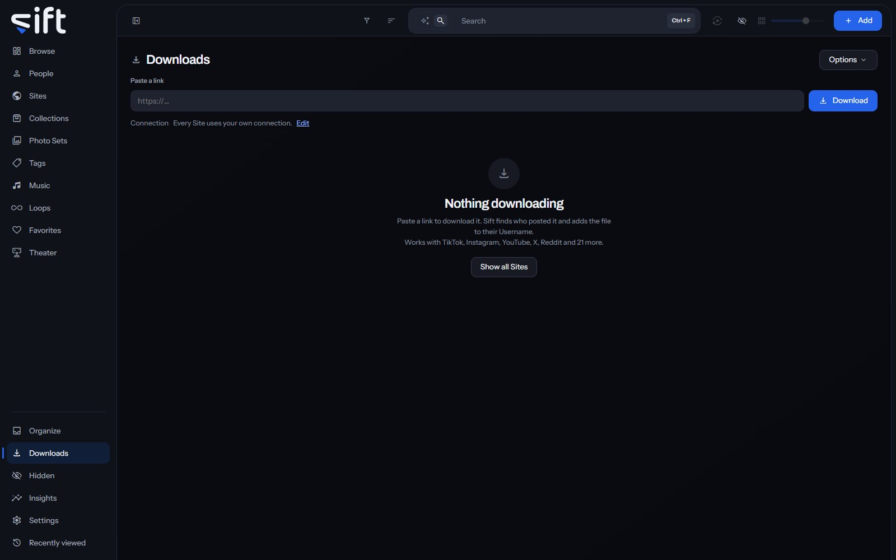

Downloads takes a link you paste, downloads what it points to, and adds the file to your library. To open it, click [Downloads](/downloads) in the sidebar.

Sift downloads with yt-dlp and gallery-dl, two open-source downloaders that know how to read each Site's pages. It finds who posted the file and adds it to their Username. To see every Site it can download from, click **Show all Sites**.

## Download a link

Paste a link into **Paste a link** and click **Download**. You can also paste anywhere on the screen, and the link lands in the box. Paste several links together to queue them all; the chips under the box name the Sites they're from.

When a link is a creator's whole page, Sift first says how many files it found. Choose **Download all** or **Download only this one**. Nothing is queued until you choose.

## The queue

The tabs over the list show each part of the queue, with how many are in it:

- **All**: every download.
- **Active**: what is downloading now and what is waiting its turn.
- **Needs you**: downloads that stopped for something only you can fix, such as missing cookies or a failure.
- **Done**: the downloads that landed.
- **Failed**: the downloads that didn't work.

**Search downloads** finds a download by its name or link. **Sort by** puts the list in one of these orders: **Newest first**, **Oldest first**, **Name A-Z**, **Name Z-A**, **Largest file**, **Smallest file** and **Site A-Z**. Click **Show more** on a row to open its details. **Copy the details** copies them, for a bug report.

## Pause and resume

**Pause the queue** holds back every download that hasn't started. Anything already downloading finishes. Click **Resume the queue** to let the rest start.

To hold back one download, choose **Pause** from its menu. What it downloaded so far is kept, and **Resume** carries on from there.

## What a download's menu does

Right-click a row, or click its three dots, to open its menu. A row offers only the rows that fit its state:

- **Add cookies**: on a download waiting for cookies, opens the cookies for its Site.
- **Move to the front**: on a waiting download, starts it next.
- **Pause** and **Resume**: hold one download back, or let it go again.
- **Cancel**: stops a download and drops what it downloaded so far.
- **Try again**: on a failed or canceled download, queues it again.
- **Open**: opens the file that landed.
- **Open quarantine**: on a quarantined download, opens [`Organize > Quarantined and skipped files`](/organize/quarantine).
- **Download it anyway**: on a download Sift skipped, downloads it after all.
- **Copy link**: copies the link the download came from.
- **Remove from the list**: takes the row off this list. The file stays in your library.

A row's state says why it stopped: **Waiting for cookies**, **Skipped**, or **Already in library** for a file you already have.

## Options

**Options**, beside the title, holds the rest of the screen's choices:

- **Edit cookies**: opens the cookies Sift holds for each Site.
- **Open settings**: opens [Settings > Downloads](/settings/downloads).
- **Start or join a swap**: opens the swap screen, to exchange files with another Sift. Only an admin sees this row.
- **Skip links you have already downloaded**: when on, a link you downloaded before isn't downloaded again.
- **Download folder**: the folder the next downloads go to.

## Cookies

Some Sites show their files only when you're signed in. Add the cookies your browser already holds for that Site, and Sift can download from it. Choose **Options > Edit cookies**, or open [Settings > Sites and Tunnels > Cookies](/settings/sites#sites.cookies). A download that needs cookies waits in **Needs you** until you add them.

## Where files go

A download lands in the folder set in [Settings > Downloads > Download folder](/settings/downloads#downloads.default_folder). To send the next downloads somewhere else, choose a folder under **Options > Download folder**. A folder outside your library is added to it.

What each file is called, and which folder under the Download folder it goes in, is set by [Settings > Downloads > Name template](/settings/downloads#downloads.name_template).

The **Connection** line under the paste box says which Sites go through a tunnel. Click **Edit** to change it in [Settings > Sites and Tunnels > Site tunnels](/settings/sites#sites.routing).
