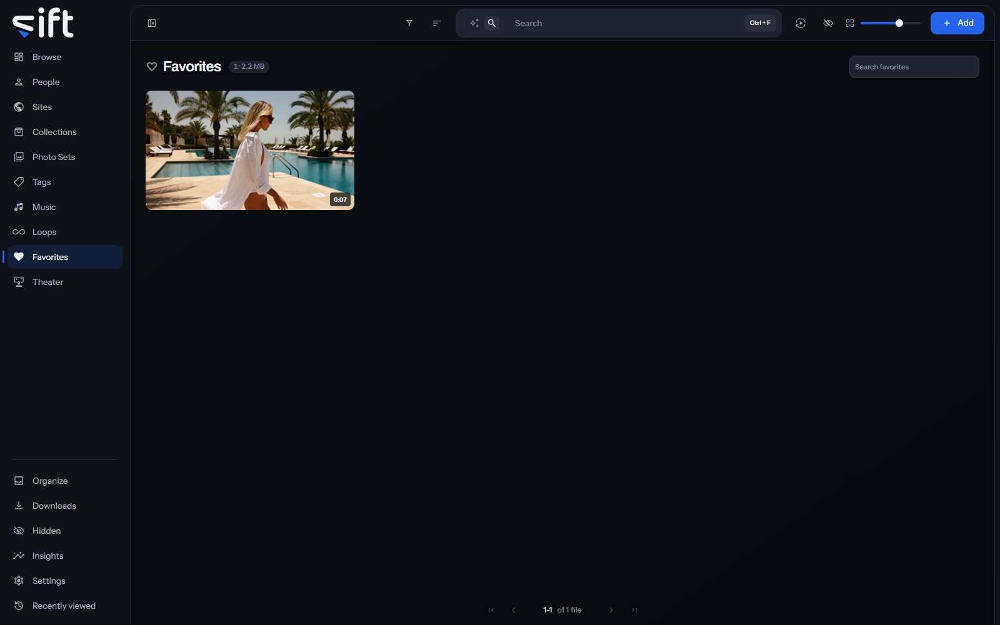

Favorites holds every file you put a heart on, so you can find it again. To open it, click [Favorites](/favorites) in the sidebar.

## Add a file to Favorites

Click the heart on a file's tile, or choose **Add to > Favorites** from its menu. To take a file off, click the heart again or choose **Remove from favorites**.

Your hearts are yours. Each User has their own Favorites, and nobody else sees what you put a heart on.

## Find a favorite

The search box at the top of Favorites searches only the files with a heart. **Filter** filters the wall the same way it does on Browse.

**Sort by** offers every order a file wall has, and two that only Favorites has:

- **Newest first** and **Oldest first**: by when the file was added to your library.
- **Recently edited**: the most recently changed first.
- **Name A-Z** and **Name Z-A**: by name.
- **Longest** and **Shortest**: by the length of a video.
- **Largest file** and **Smallest file**: by size on disk.
- **Recently viewed** and **Most viewed**: by your own viewing.
- **Highest O count**: by the O count you gave each file.
- **Recently favorited**: the file you put a heart on last comes first.
- **Oldest favorited**: the file you put a heart on first comes first.
- **Random**: a shuffle that holds while you page. Choose **Shuffle again** for a new one.
- **Similarity**: files that look like a Smart Search or a file. It's unavailable until you search for one.

## What a file's menu does

Right-click a tile, or click its three dots, to open its menu:

- **Similar to this**: shows files that look like this one.
- **Add to**: adds the file to a Person, Site, Collection, Photo Set, Tag or Song, or to Favorites.
- **Pin**: keeps the file at the top of its wall.
- **Rating**: gives the file a rating.
- **Copy link**: copies a link to the file.
- **Save to device**: saves a copy to the device you're using. On a picture, **Copy image** copies it instead.
- **Modify** on a picture, or **Trim** on a video: opens the editor.
- **Create GIF**: makes a GIF from a video.
- **Compress**: makes a smaller copy of a video or a GIF.
- **Move**: moves the file to another folder in your library.
- **Rename**: renames the file.
- **Run task**: runs one of Sift's tasks on the file now.
- **Auto-enrich** and **Enrich**: look the file up on a stash-box.
- **Don't enrich**: keeps the file out of stash-box lookups. On a file kept out, the row reads **Allow enrichment**.
- **Don't swap**: keeps the file out of a swap. On a file kept out, the row reads **Allow swapping**.
- **Hide**: moves the file into [Hidden](/library/hidden/#what-hidden-holds).
- **Share**: shares the file with another User.
- **Visibility**: shows who can see the file, and why.
- **Remove**: takes the file out of Sift. The next question asks whether to delete it from the disk as well.

Only an admin sees Move, Rename, Modify, Trim, Create GIF, Compress, the three stash-box rows and Remove. Move and Rename appear only where Sift can write in the file's folder.
