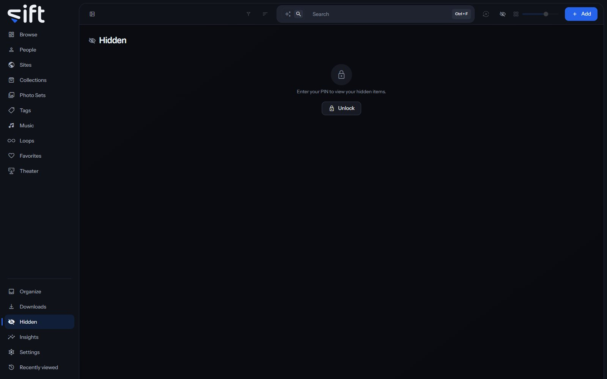

Hidden holds everything you hid, in one wall, and shows it only after you enter your PIN. To open it, click [Hidden](/hidden) in the sidebar.

## What Hidden holds

Choose **Hide** from the menu of a file, a person, a collection or a folder, and it leaves every wall, count and search in Sift. Everything a hidden person or folder holds is hidden with it. While Hidden is unlocked, the same row reads **Unhide**.

Hidden keeps things off the screen. Your files stay on the disk exactly where they were, and Sift doesn't encrypt them. Hidden guards against someone looking over your shoulder or a screen you're sharing, not against someone holding the disk.

## Your PIN

Hiding and showing things takes a PIN of six digits. The first time you open Hidden without one, you're asked to create it. To change it later, open [Settings > Profile > PIN](/settings/profile#profile.pin).

Sift slows down repeated wrong guesses, and after too many it stops taking the PIN for a while.

## Unlock and lock Hidden

Click **Unlock** on the Hidden screen, or **Show hidden items** on the top bar, and enter your PIN. Hidden things come back into every wall, and the Hidden screen lists them all with its own search box.

To lock it again, click **Hide** on the Hidden screen or **Hide hidden items** on the top bar. The top bar's control works from every screen, so you can lock Hidden from wherever you are.

Unlocking applies to the browser you unlocked it in. Restarting Sift always locks Hidden. These settings lock it for you:

- [Settings > Privacy and Security > Lock Hidden after](/settings/privacy#vault.lock_after_idle_minutes): after this long without use.
- [Settings > Privacy and Security > Lock Hidden when you switch away](/settings/privacy#vault.lock_on_blur): every time you leave Sift's window.
- [Settings > Privacy and Security > Lock Hidden when Sift opens](/settings/privacy#vault.lock_on_launch): each time you open Sift.
- [Settings > Privacy and Security > Lock Hidden when you quit Sift](/settings/privacy#vault.lock_on_close): when you quit, so the next person finds it locked.

## How hidden files look while locked

[Settings > Privacy and Security > How Hidden hides files](/settings/privacy#vault.concealment) decides what you see while Hidden is locked:

- **Show nothing**: hidden things are left out of every list, count and search.
- **Show a locked tile**: a tile shows that something is there, but not what it is.

Either way, Sift never sends a hidden file to your browser until you unlock Hidden.

## Hidden and other Users

Hiding is personal. Each User has their own Hidden and their own PIN, and what you hide is hidden for you only.

Nobody else can open your Hidden, an admin included. Sift never tells another User, a guest included, what you hid or that you hid anything.
