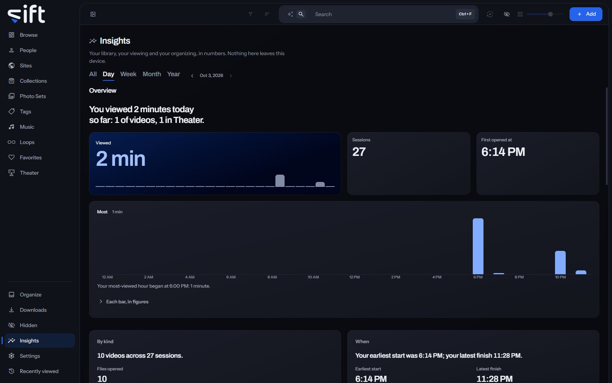

Insights shows your library, your viewing and your organizing in numbers, for a day, a week, a month, a year or all of it. To open it, click [Insights](/insights) in the sidebar.

Everything Insights counts stays on the device Sift runs on, and only you see your own.

## Choose a period

The tabs at the top choose the period: **All**, **Day**, **Week**, **Month** or **Year**. **Earlier** and **Later** step to the period before or after. Each period has its own address, so Back returns to the one before and you can bookmark one.

## What is counted

Insights opens with a sentence about the period and the time you spent viewing. The cards under it each say one thing:

- **Overview**: how long you viewed, in how many sessions, and when you opened Sift first, with a chart of the period.
- **By kind**: your viewing split into videos, pictures and Theater, the files you opened and came back to, and the Photo Sets you looked through.
- **When**: your earliest start and latest finish, and the hours you view most.
- **Most viewed**: your top People, Sites, Tags, Photo Sets and Files.
- **Theater**: the time you spent in [Theater](/library/theater/#keep-a-wall-to-open-again), in how many sessions, and the Saved Layouts you watched.
- **Visits**: how many times you opened Sift, and under **First opened**, the people you opened first.
- **Opinions**: the files you rated and starred and your O count, with **Files you starred** and **Most O presses**.
- **Organizing**: the questions you answered in [Organize](/library/organize/#the-board), card by card.
- **What arrived**: the files added to your library, by Site.
- **What Sift did**: how long Sift worked on its tasks, by task. Only an admin sees this card.

Point at a bar, a day or an hour of a chart to read its figures. With the keyboard, a chart is one stop and the arrows move along it. Every figure says what it counts when you point at it. **Stats**, at the end of the row of tabs, shows every figure of the period as tables. Each table has a **Copy**.

**Alongside**, on Week, Month, Year and All, says what moved together in your own record. It needs at least eight periods, and it never says one thing caused another. For example: "Over 9 weeks, the weeks you viewed Theater most were the weeks you starred the most files."

A card with too little to say yet is left out. While [Hidden](/library/hidden/#unlock-and-lock-hidden) is locked, the figures leave out what you hid, and the page says so. Unlock Hidden to include it.

## Recaps

A recap is a day, a week, a month or a year told in a handful of cards. Sift creates one the day after the period closes, when there was enough viewing in it. A new recap is announced at the top of Insights and on Browse, a week's for a week and a day's for a day. [Settings > Insights](/settings/insights#insights.recap_day) turns each kind of recap on or off; the ones already created stay. A recap re-counted after a correction says so in History.

The recaps are listed under **Recaps** at the foot of Insights. Open one to step through its cards, all one size, with **Earlier** and **Later**. **Save as picture** saves a picture of the card to the folder your screenshots go to, set in [Settings > Playback > Save screenshots to](/settings/playback#playback.screenshot_folder). **See this week in Insights** opens the same period on the Insights page.

A recap keeps its figures as they were when the period closed. Something you hide later still leaves its cards while Hidden is locked.

## Stop counting

Insights counts what Sift notes about your use: what you watch, open and search for. To pause it, turn off [Settings > Privacy and Security > Keep your history](/settings/privacy#history.keep). Nothing new is noted until you turn it on again.
