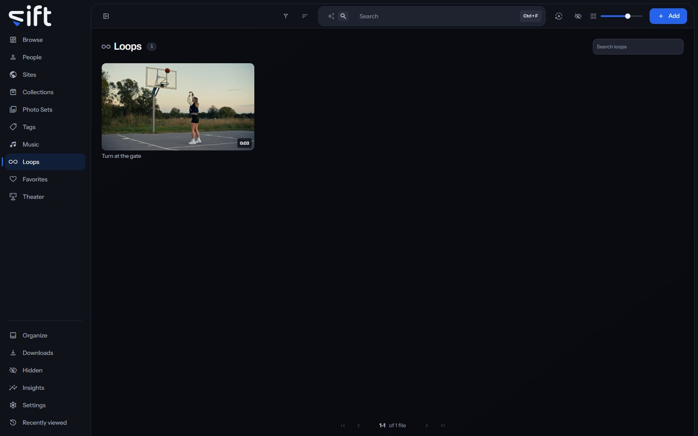

Loops holds every stretch of a video you saved as a Loop, each as a tile that plays the stretch. To open it, click [Loops](/loops) in the sidebar.

## Save a Loop

A Loop is cut in the player, from a video that's playing:

1. Open a video and play it.
2. Press **L** at the start of the stretch you want, and press **L** again at its end.
3. Click **Save as Loop**.

Sift saves the stretch as a clip of its own, so the tile plays exactly what you marked. The video you cut it from doesn't change. In Theater, the same two presses and **Save as Loop** are in each cell's controls; see [Theater](/library/theater/#the-bar-under-the-wall).

## Find a Loop

The search box at the top of Loops finds a Loop by its own name or by the name of the file it's cut from. **Filter** filters the wall by the files the Loops are cut from, the same way it does on Browse.

**Sort by** puts the wall in one of these orders:

- **Recently created**: the newest Loop first.
- **Oldest created**: the first Loop you saved first.
- **Recently edited**: the most recently changed first.
- **Name A-Z** and **Name Z-A**: by name.
- **Longest** and **Shortest**: by the length of the Loop, not of the video.

## What a Loop's menu does

Right-click a tile, or click its three dots, to open its menu. Most rows act on the video the Loop is cut from, as they do on every wall:

- **Similar to this**: shows files that look like this one.
- **Add to**: adds the video to a Person, Site, Collection, Photo Set, Tag or Song, or to Favorites.
- **Pin**: keeps the video at the top of its wall.
- **Rating**: gives the video a rating.
- **Copy link**: copies a link to the video.
- **Save to device**: saves a copy of the video to the device you're using.
- **Create GIF**: makes a GIF from the video.
- **Rename**: renames the video's file.
- **Run task**: runs one of Sift's tasks on the video now.
- **Auto-enrich** and **Enrich**: look the video up on a stash-box.
- **Don't enrich**: keeps the video out of stash-box lookups.
- **Don't swap**: keeps the video out of a swap.
- **Hide**: moves the video into [Hidden](/library/hidden/#what-hidden-holds).
- **Share**: shares the video with another User.
- **Visibility**: shows who can see the video, and why.

Only an admin sees Rename, Create GIF and the three stash-box rows.

The last rows act on the Loop itself:

- **Tag this loop**: puts a tag on the Loop, not on the whole video. Only an admin sees this row.
- **Save as a clip**: turns a Loop that's still a stretch of its video into a clip of its own. It's offered only on those Loops.
- **Rename this loop**: gives the Loop a name, shown under its tile.
- **Delete this loop**: deletes the Loop. The video keeps every byte.

Select several tiles to delete them together. Moving, compressing, trimming or deleting the video isn't offered here, so a press on a Loop can't remove the video by mistake.
