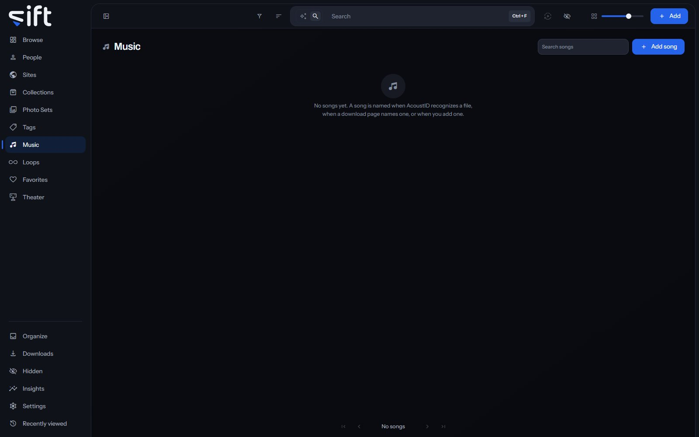

Music lists the songs your files carry, with the artists each song credits. To open it, click [Music](/songs) in the sidebar.

Sift recognizes a song by its sound with Chromaprint, which makes a music fingerprint of each file on your computer. AcoustID, a free online service, can name the song from that fingerprint.

## How songs are found

Sift finds songs in two steps:

1. **Music fingerprints**: Sift makes a short summary of each file's sound on your computer. Nothing is sent anywhere to make one. Files whose fingerprints line up share a song.
2. **Song names**: with your AcoustID key added, AcoustID names the song. Sift sends it the fingerprint of the first two minutes and the file's length, never the file.

Choose when fingerprints are made in [Settings > Music > When music fingerprints are made](/settings/music#music.fingerprints). Turn on naming, and add your key, in [Settings > Music > Name songs with AcoustID](/settings/music#music.lookup).

AcoustID names whole songs, not short clips. A short clip gets its song from a longer file it shares the song with. A song can also come from a download page that names it, or from you. **Add song** makes one, and **Add to** > **Song** puts it on files.

AcoustID learns new songs over weeks, so a file it didn't know can be asked again later. [Settings > Music > Ask AcoustID again](/settings/music#music.acoustid-again) does that for every file waiting, and **Auto-enrich** > **Ask AcoustID again** in a file's menu does it for one file at any time.

## The wall of songs

Each card shows the song's cover, or a music note, and how many files carry it. Under the song's name are the artists it credits; click an artist to filter the wall to that artist's songs. **Search songs** finds a song by its name.

**Sort by** offers **Newest first**, **Oldest first**, **Recently edited**, **Name A-Z**, **Name Z-A**, **Most files**, **Fewest files**, **Favorites first**, **Highest rated** and **Artist A-Z**. Four more orders add up every file under each song. **Largest in total** and **Smallest in total** go by size, and **Longest in total** and **Shortest in total** by length. **Artist A-Z** orders the songs by their first artist, with songs that credit nobody last.

**Filter** opens these columns:

- **Artists**: the artists a song credits.
- **Has a cover photo**: whether the song has a cover.
- **Created by**: what made the song: you, or Sift from AcoustID or a download.
- **Sharing status**: who the song is shared with. Only an admin sees this column.

## A song's menu on the wall

Right-click a card, or select several, to open the menu. A song carries no tags of its own, and no stash-box knows one. So its menu has no Tag, Auto-enrich, Enrich, **Don't enrich** or **Allow enrichment** row:

- **Add to favorites**: adds the song to your Favorites, or **Remove from favorites** takes it off.
- **Pin** or **Unpin**: keeps the song at the top of the wall, or takes it off.
- **Rating**: gives the song stars.
- **Merge**: folds the songs you picked into one, such as a name you typed and the one AcoustID gave. You choose which one stays.
- **Rename**: gives the song another name.
- **Hide** or **Unhide**: moves the song into Hidden for you, or brings it back.
- **Share**: chooses the Users who see the song.
- **Visibility**: shows who can reach the song, and through what.
- **Delete**: takes the song off every file carrying it and leaves their Music field empty. The files themselves aren't touched.

Only an admin sees Merge, Rename, Share, Visibility and Delete.

## A song's page

The page shows every file that carries the song. Its tabs each show one side of it: **Files**, **Loops**, **People**, **Tags**, **Sites**, **Collections** and **History**. Its **Tags** tab shows the tags on its files.

A file's menu on this page has two more rows:

- **Remove from this song**: takes the song off this file.
- **Use as this song's cover**: makes the file the song's cover.

**Options** at the top of the page holds **Sharing**, **Visibility**, **Merge into&hellip;**, **Delete**, and **Hide it** or **Stop hiding it**.

## Same music on a file

When other files share a file's song, the file page shows them in a strip called **Same music**, closest first. Click its heading to see every one of them on the Browse wall.
