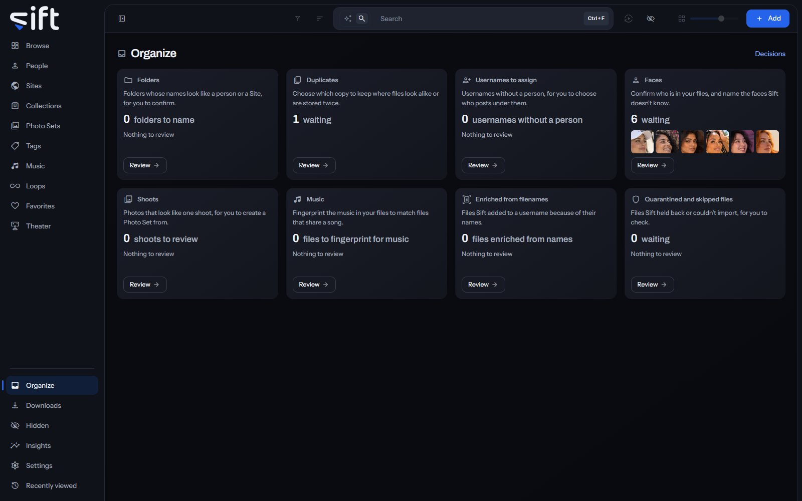

Organize is the board where Sift's questions about your library wait for your answer, one card per group of questions. To open it, click [Organize](/organize) in the sidebar.

## The board

Every card is on the board at all times. A card says what it's for, how many items wait in it, and shows a few of them. A card with nothing waiting says **Nothing to review**. Click **Review** on a card to open its page.

The work comes first on the board, then the tidying, then what Sift couldn't read. When nothing is waiting, the board says so. Organize is meant to be empty most of the time.

Every answer you give here is a line in your history, with its Undo. Click **Decisions**, beside the title, to open them in [Settings > Tasks and Activity > App History](/settings/tasks#activity.decisions). Only an admin sees Organize.

## Folders

Folders holds the folders whose names look like a person, a Site or a username. It has two tabs.

**Folders to review** holds one question a folder. Each says why, such as **The same face runs through this folder**. Answer with:

- **Yes, a person**: adds every file in the folder to that person, creating them if they're new.
- **Yes, a Site**: makes the word a Site and adds the folder to it. Each file's person comes from the file's own name.
- **Yes, add to that username**: adds the folder to that username on its Site, and to nobody.

Click the arrow beside the answer for the others:

- **No, not a person**, **No, not a Site** or **No, not that username**: Sift sets the name aside permanently and changes no file.
- **Someone else**: names the folder as a different person.
- **No, it's one person**: on a Site or username question, says the folder is one person's.

Files that don't match the rest of the folder are listed under it. Deselect any you want to leave out before you answer.

**Added without asking** lists the folders whose faces or name already matched a person in your library, so Sift added their files without asking. Click **Undo** on a folder to take that person off the files Sift added. Sift won't add that folder to them again.

## Faces

Faces holds the questions about who is in your files. Sift finds faces with the InsightFace models and groups the ones that look alike. It has five tabs.

**Faces to confirm** shows groups of faces that look like people you already named, the surest first. Click **Yes** to confirm a group, or click the arrow beside it for **No**, **No, one at a time** or **Show me**. Each answer teaches Sift that person. Type a name in **Search people** at the end of the tabs to see only that person's questions. Sift matches the name and its aliases, and the tab's count and the pages count what it found.

**Disagreements** lists files whose name says one person while their face is named as another. Choose which is right. **Yes, these are** that person answers for the whole group. For one face, choose **Yes, this face is** that person, or **No, take** that person **off this file**. A correction fixes the name everywhere.

**Unnamed faces** holds groups of look-alike faces Sift can't name yet, the largest first. Click **Add as person** and type a name. One answer names every face in the group. The arrow beside it offers **Discard**, so Sift doesn't ask about the group again, and **Delete**, which deletes the faces Sift found in the group. Your files aren't touched, and a deleted face can't be brought back.

A group can look like someone from a facial fingerprints file you added in [Settings > Faces](/settings/faces). The group then offers **Create a person**, which creates them. It's offered only while [Settings > Faces > Create people from these fingerprints as their faces are recognized](/settings/faces#faces.people_from_files) is off.

**Discarded** lists the groups you discarded. Click **Restore** to have Sift ask about one again.

**People Sift can recognize** lists everyone Sift has faces for, what you confirmed and what still needs your input. **Starter pictures only** and **Everyone else** split the list. **Search people** finds anyone by name or alias, and the counts follow what it found. Click **Yes** with the count to confirm a person's waiting faces, or use the arrow for **No**, **No, one at a time** or **Show me**.

## Duplicates

Duplicates holds files stored more than once or that look alike. It has two tabs.

**Near duplicates** shows groups of files that look alike, with the copy Sift would keep marked. Three choices at the top decide the groups:

- **Which copy to keep**: the rule Sift uses to choose the copy.
- **How similar duplicates must be**: how alike two files must look. A looser setting shows more pairs straight away, without comparing again.
- **Largest difference in length**: how far apart two videos' lengths may be.

Click **Keep this instead** on a file to keep it rather than Sift's choice, or **Keep all** to keep every file in a group. **Confirm this page** answers every group on the page. **Show the ones that need you** shows only the groups no rule could decide, and **Show all groups** brings the rest back. **Copy details** gives each duplicate the details of its identical copy and deletes nothing.

**Exact duplicates** shows the same file, byte for byte, in more than one place. Choose the copy to keep with **Keep this instead**, then **Delete this copy**, or **Delete the extra copies on this page** for every group shown. Deleting frees the disk space permanently, and the copy you keep keeps everything recorded about it.

The same three choices are in [Settings > Maintenance > Which copy to keep](/settings/maintenance#dedup.keep), [Settings > Maintenance > How similar duplicates must be](/settings/maintenance#dedup.level) and [Settings > Maintenance > Largest difference in length](/settings/maintenance#dedup.max_duration_gap_seconds).

## Usernames to assign

Usernames to assign lists the usernames Sift couldn't give a person, because two people share the name or nobody has it yet. Click **Choose person** to say who posts under a username, or **Open the files** to look at them first.

## Shoots

Shoots holds runs of one creator's photos that look like one shoot and are in no Photo Set. Click **Create Photo Set** to make one from the shoot. The arrow beside it offers **Create with a name** and **Discard**. Where some photos have no person yet, it also offers **Name the rest**.

## Music

The Music card counts the files whose music Sift hasn't fingerprinted yet. Its **Review** opens the task that does it, in [Settings > Tasks and Activity](/settings/tasks#tasks.music.when). Sift fingerprints music with Chromaprint and names songs through AcoustID.

## Files a stash-box recognized

This card appears after you set up a stash-box, such as StashDB, FansDB or PMVStash, in [Settings > Stash-boxes](/settings/stash-boxes). It has three tabs.

**Matches to review** holds what a stash-box found for each file where the match wasn't certain. **Waiting** and **Answered** split the list. Each match says how sure it is, such as **Exact fingerprint** or **Looks the same, length agrees**, and shows the stash-box's details beside yours.

For each field, choose **Keep** for yours or **Use** for the stash-box's. Deselect a match to leave it out. **Apply to** saves the chosen matches, and **Discard** sets them aside. Nothing is saved until you confirm, and Auto-enrich adds exact matches without asking.

**Enriched by a stash-box** lists every person, Site and tag linked to a stash-box. **Which kind** filters it to **Everything**, **People**, **Sites** or **Tags**, and **See them in Browse** shows the files. There's nothing to decide here. To remove a link, open the record.

**Names with more than one entry** lists names a stash-box has several entries for. Click **Choose** on a name to pick the right one.

## Enriched from filenames

Enriched from filenames lists the files Sift added to a username because their names hold a Site's username, post or ID. They're grouped by username, the largest first. A username says where a file came from, not who is in it, so no person is named. Click **Open these files** to check a group. To undo a group that doesn't belong, choose **No, take these files back** from the arrow beside it.

## Quarantined and skipped files

This page has two tabs.

**Quarantine** holds downloads whose bytes weren't the file the page promised, and files you uploaded, dropped or pasted that aren't a picture or a video. They stay here until you delete them. Click the delete button on a file to delete it permanently. Sift deletes them itself after the time set in [Settings > Maintenance > Delete quarantined files after](/settings/maintenance#quarantine.keep_days).

**Skipped** lists files in your folders that Sift can't import, with the reason. They stay where they are. Click **Try again** to include a file in the next scan.
