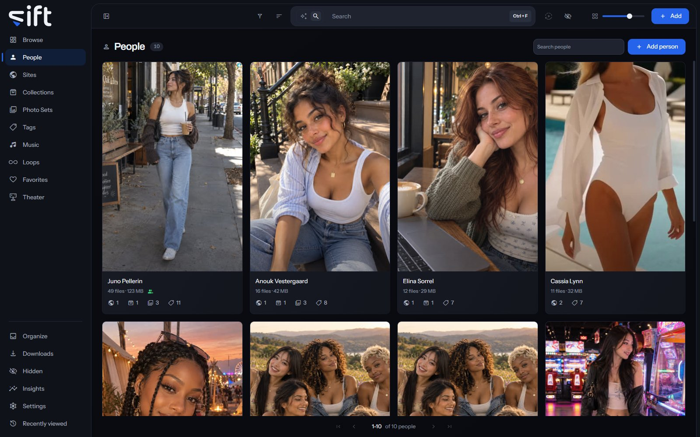

People holds a card for each person in your files, and a page with everything Sift has filed under them. To open it, click [People](/people) in the sidebar.

Sift recognizes faces with the InsightFace models, which run on your computer. It looks people up on the stash-boxes you add, such as StashDB, PMVStash and FansDB.

## The People wall

Each card shows a person's cover, how many files they're on and how much room those take. The marks under it count the Sites, Collections, Photo Sets and tags their files are in. Click a card to open the person's page.

**Search people** finds a person by their name or any other name they go by. **Add person** makes a person with a name and, if you like, a picture.

**Sort by** offers **Newest first**, **Oldest first**, **Recently edited**, **Name A-Z**, **Name Z-A**, **Most files**, **Fewest files**, **Favorites first** and **Highest rated**. Four more orders add up every file under each one. **Largest in total** and **Smallest in total** go by size, and **Longest in total** and **Shortest in total** by length.

**Filter** opens columns about the people themselves:

- **Gender**, **Hair color**, **Eye color**, **Ethnicity**, **Nationality**, **Breast type** and **Height**: from each person's record.
- **Age**: worked out from the birthdate, in bands.
- **Career start**: the year their career started.
- **PMV creator**: whether they make PMVs.
- **Tags**: the tags on the person, not on their files.
- **Enriched by**: which stash-box filled in the person, or **Not enriched**.
- **Has a cover photo**: whether the person has a cover.
- **Created by**: what made the person: you, a stash-box, or Sift automatically from a folder name, a face, a download or a swap.
- **Sharing status**: who the person is shared with. Only an admin sees this column.
- **Stash-box disagreements**: people whose stash-boxes give different answers. Only an admin sees this column.

## A person's menu on the wall

Right-click a card, or select several, to open the menu:

- **Add to**: holds **Tag**, which puts a tag on the person, and **Favorites**.
- **Pin** or **Unpin**: keeps the person at the top of the wall, or takes them off.
- **Rating**: gives the person stars.
- **Merge**: folds the people you picked into one. You choose which one stays.
- **Rename**: gives the person another name.
- **Auto-enrich**: asks the stash-boxes about the person and keeps an exact match. Its rows choose **All stash-boxes** or one box.
- **Enrich**: shows what the stash-boxes answer, so you choose the match yourself.
- **Don't enrich** or **Allow enrichment**: keeps the person from being sent to any stash-box, or lets Sift ask about them again.
- **Hide** or **Unhide**: moves the person into Hidden for you, or brings them back.
- **Share**: chooses the Users who see the person.
- **Visibility**: shows who can reach the person, and through what.
- **Delete**: takes the person off every file they're on and forgets their other names. The files themselves aren't touched.

Only an admin sees Add to's Tag, Merge, Rename, the three stash-box rows, Share, Visibility and Delete.

## A person's page

The page opens with the person's cover and what Sift has on them. Under the name, the other names they go by appear as chips, and their links as marks. A line says how many files they're on.

The line **Created by** says what made the person. **Created by Sift, from a folder name** means Sift made them from the name of a folder their files are in.

Point at the cover for **Change the picture**, **Reframe the cover** and **Remove the cover**. Click the cover to see it full size. The button at the right, **Hide the details**, folds this part away so the files start at the top.

**More** opens the whole record, with every field shown, and **Less** closes it again. **Edit** turns the record into a form; click **Save** or **Cancel** when you're done.

## The faces lines

When Sift recognizes faces, the lines under the cover say what it knows of this person's face:

- **You confirmed** a number of faces as this person. Only a face you confirm teaches Sift what they look like.
- **Sift recognized** a number as this person automatically. Click the line to review them in Organize.
- **Awaiting your input** counts the faces Sift thinks may be them. Click it to say yes or no to each one.
- **Files from the folder with a face still unnamed** counts the files filed under them from a folder whose face nobody has named. Click it to see those files in Browse.

A bar under the lines shows how well Sift recognizes this person. Its sentence reads, for example, **Sift now identifies Anouk effectively**. A line with nothing to count isn't shown.

Recognition is turned on in [Settings > Faces > Recognize faces in your library](/settings/faces#faces.enabled).

## Aliases and stash-box links

**Aliases** in the form holds the other names a person goes by, one each. Searching for any of them finds the person.

**Stash-boxes** lists the stash-box entries the person is linked to. **Auto-enrich** and **Enrich** make that link and fill in fields from it. [Settings > Stash-boxes > Auto-enrich using](/settings/stash-boxes#stash_boxes.auto_box) chooses the box a plain **Auto-enrich** asks. A row for each field, such as [Settings > Stash-boxes > Name](/settings/stash-boxes#enrich.person.name), chooses whether a stash-box fills it in, replaces it or leaves it alone.

## The tabs

The tabs under the header each show one side of the person: **Files**, **Photo Sets**, **Loops**, **Tags**, **Sites**, **Collections**, **Music**, **Seen with** and **History**. **Seen with** shows the people who appear in the same files.

Select cards on **Seen with**, **Tags** or **Sites** to filter the **Files** tab to the files with them. The count beside the tab words says how many you picked, and its cross clears them.

On the **Files** tab, a tile's own row **Use as the cover** makes that file the person's cover.

## Options

**Options** at the top of a person's page holds:

- **Auto-enrich** and **Enrich**: ask the stash-boxes about this person, as on the wall.
- **Don't enrich** or **Allow enrichment**: keeps this person away from every stash-box, or lets Sift ask about them again.
- **Sharing**: chooses the Users who see this person.
- **Visibility**: shows who can reach this person, and through what.
- **Merge into&hellip;**: folds this person into another one you pick. Their files, usernames, aliases, links and confirmed faces move across, and empty fields are filled in. A merge can't be undone.
- **Hide them**: moves the person into Hidden. On a hidden person the row reads **Stop hiding them**, which brings the person back.
- **Delete**: deletes the person, as on the wall.
