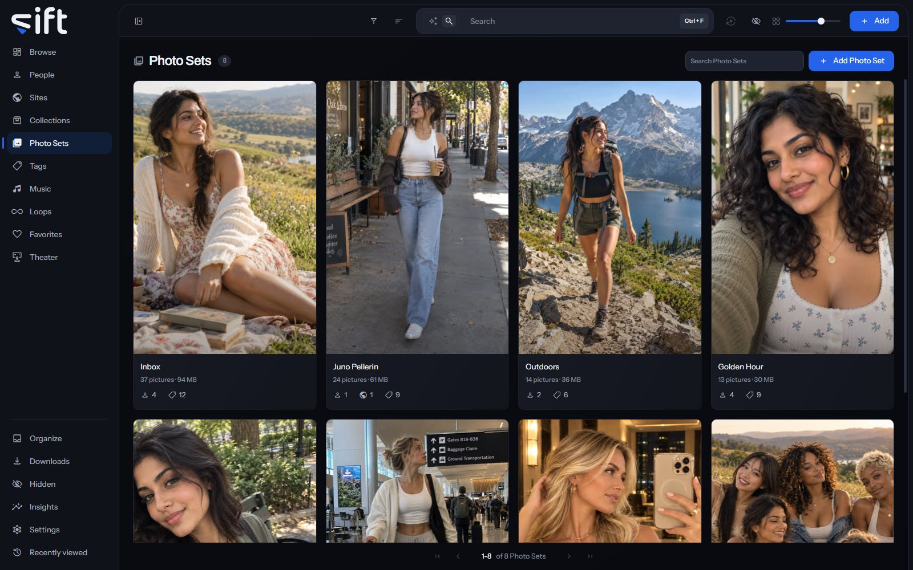

Photo Sets holds the pictures that belong together, such as a folder of photos, a ZIP file or one shoot. To open it, click [Photo Sets](/photo-sets) in the sidebar.

A Photo Set is a grouping only. Deleting one leaves every picture in it in its place on the disk.

## Where Photo Sets come from

Sift makes a Photo Set in three ways, each with its own switch in Importing:

- **From a folder**: a folder with 10 or more photos and no videos becomes a Photo Set named after the folder. See [Settings > Importing > Create Photo Sets from folders](/settings/importing#photo_sets.from_folders).
- **From a ZIP file**: a ZIP file with 10 or more photos inside becomes a Photo Set named after the file. See [Settings > Importing > Create Photo Sets from ZIP files](/settings/importing#photo_sets.from_archives). Sift doesn't change a ZIP file, so a picture inside one can't be deleted from disk. Choose [Remove](/library/browse/#a-files-menu) and then **Remove from Sift**, and later scans leave it out.
- **From a shoot**: a run of one creator's photos taken together, in the same place, light and outfit. See [Settings > Importing > Create Photo Sets from shoots](/settings/importing#shoots.auto_file).

With shoots turned off, each shoot Sift finds waits in [Organize](/organize/shoots) under **Shoots** until you choose **Create Photo Set**. You can also make a Photo Set yourself with **Add Photo Set**, and fill it by choosing **Add to** > **Photo Set** on any pictures.

The line **Created by** on a Photo Set's page says which way it was made, such as **Created by Sift, from a folder name**.

## The Photo Sets wall

Each card shows the Photo Set's cover, how many pictures it holds and how much room they take. The marks under it count the people, Sites and tags in it. **Search Photo Sets** finds one by its name.

**Sort by** offers **Newest first**, **Oldest first**, **Recently edited**, **Name A-Z**, **Name Z-A**, **Most files**, **Fewest files**, **Favorites first** and **Highest rated**.

**Filter** opens these columns:

- **Tags**: the tags on the Photo Set.
- **Has a cover photo**: whether the Photo Set has a cover.
- **Created by**: what made the Photo Set: you, a folder, a ZIP file or a shoot.
- **Sharing status**: who the Photo Set is shared with. Only an admin sees this column.

## A Photo Set's menu on the wall

Right-click a card, or select several, to open the menu:

- **Add to**: holds **Tag**, which puts a tag on the Photo Set, and **Favorites**.
- **Pin** or **Unpin**: keeps the Photo Set at the top of the wall, or takes it off.
- **Rating**: gives the Photo Set stars.
- **Rename**: gives the Photo Set another name.
- **Hide** or **Unhide**: moves the Photo Set into Hidden for you, or brings it back.
- **Share**: chooses the Users who see the Photo Set.
- **Visibility**: shows who can reach the Photo Set, and through what.
- **Delete**: deletes the grouping. The pictures stay exactly where they are on the disk.

Only an admin sees Add to's Tag, Rename, Share, Visibility and Delete. No stash-box knows a Photo Set, so its menu has no Auto-enrich, Enrich, **Don't enrich** or **Allow enrichment** row.

## A Photo Set's page

The page shows the pictures in the set. Its tabs each show one side of it: **Pictures**, **People**, **Tags**, **Sites** and **History**.

**More** opens the whole record, and **Edit** turns it into a form with its **Name**, **Details** and **Downloaded from**.

A picture's menu on this page has two more rows:

- **Remove from this Photo Set**: takes the picture out of the set. The picture itself isn't touched.
- **Use as this set's cover**: makes the picture the Photo Set's cover.

**Options** at the top of the page holds **Sharing**, **Visibility** and **Delete**, which do what they do on the wall.
