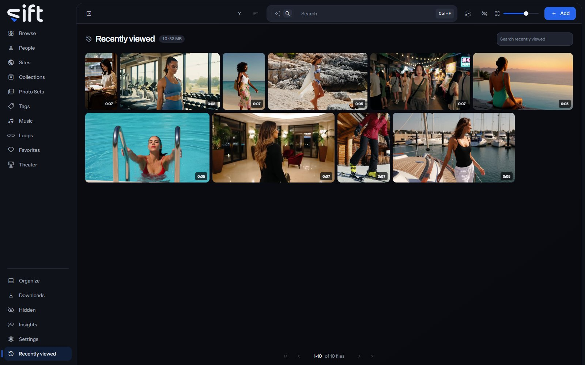

Recently viewed lists the files you opened last, newest first. To open it, click [Recently viewed](/recent) in the sidebar.

## Find a file you opened

**Search recently viewed** finds a file among the ones you opened. The order is always newest first, so this wall has no **Sort by**. Right-click a tile for the same menu as on Browse; see [A file's menu](/library/browse/#a-files-menu).

Each User has their own Recently viewed, so nobody else sees what you opened. Whatever you play or look at turns up here.
