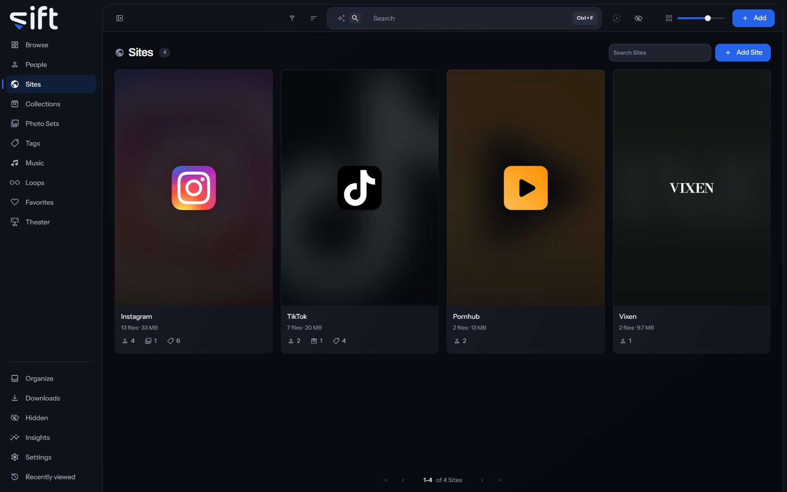

Sites holds a card for each Site your files came from, such as Instagram or TikTok, and a page with everything filed under it. To open it, click [Sites](/sites) in the sidebar.

Sift downloads from a Site with yt-dlp and gallery-dl. A Site can download through a WireGuard tunnel instead of your own connection.

## The Sites wall

Each card shows the Site's logo, how many files came from it and how much room those take. The marks under it count the people, Photo Sets, Collections and tags its files are in. Click a card to open the Site's page.

The logos come from a pack that ships with Sift, with one for each of hundreds of Sites, found by the Site's address. Sift never downloads a logo from a Site while you use it, so drawing this wall tells no Site what is in your library. A Site the pack doesn't have shows its first letter until you choose a picture.

**Search Sites** finds a Site by its name or any of its aliases. **Add Site** makes a Site with a name and, if you like, a picture.

**Sort by** offers **Newest first**, **Oldest first**, **Recently edited**, **Name A-Z**, **Name Z-A**, **Most files**, **Fewest files**, **Favorites first** and **Highest rated**. Four more orders add up every file under each one. **Largest in total** and **Smallest in total** go by size, and **Longest in total** and **Shortest in total** by length.

**Filter** opens columns about the Sites:

- **Network**: the network a Site belongs to.
- **Tags**: the tags on the Site, not on its files.
- **Enriched by**: which stash-box filled in the Site, or **Not enriched**.
- **Usernames**: whether the Site has usernames.
- **Has a cover photo**: whether the Site has a cover.
- **Created by**: what made the Site: you, a stash-box, or Sift automatically from a folder, a download or a swap.
- **Sharing status**: who the Site is shared with. Only an admin sees this column.
- **Stash-box disagreements**: Sites whose stash-boxes give different answers. Only an admin sees this column.

## A Site's menu on the wall

Right-click a card, or select several, to open the menu:

- **Add to**: holds **Tag**, which puts a tag on the Site, and **Favorites**.
- **Pin** or **Unpin**: keeps the Site at the top of the wall, or takes it off.
- **Rating**: gives the Site stars.
- **Merge**: folds the Sites you picked into one. You choose which one stays.
- **Rename**: gives the Site another name.
- **Auto-enrich**: asks the stash-boxes about the Site and keeps an exact match. Its rows choose **All stash-boxes** or one box.
- **Enrich**: shows what the stash-boxes answer, so you choose the match yourself.
- **Don't enrich** or **Allow enrichment**: keeps the Site from being sent to any stash-box, or lets Sift ask about it again.
- **Hide** or **Unhide**: moves the Site into Hidden for you, or brings it back.
- **Share**: chooses the Users who see the Site.
- **Visibility**: shows who can reach the Site, and through what.
- **Delete**: forgets the Site and where its files came from. The people and the files stay.

Only an admin sees Add to's Tag, Merge, Rename, the three stash-box rows, Share, Visibility and Delete.

## A Site's page

The page opens with the Site's logo or cover, how many files and people it has, and the line **Created by**. **Created by Sift, from a mirror folder** means Sift made the Site from a folder named for one username on it, such as `cassialynn (Instagram)`.

**More** opens the whole record, and **Edit** turns it into a form. A Site's record holds its **Name**, **Links**, **Details**, **Tags** and **Aliases**. **Part of** names the network it belongs to, and **Stash-boxes** the stash-box entries it's linked to.

The tabs each show one side of the Site: **Files**, **Photo Sets**, **Loops**, **Sites**, **People**, **Tags**, **Collections**, **Music** and **History**. **Sites** shows the Sites that are part of this one, when it's a network.

## Usernames

A username is a person's name on one Site, so the same name on two Sites is two usernames. A username has no page of its own: it stands on its Site's **People** tab, under the person it belongs to.

Each person on the **People** tab shows how many files came from this Site. Under it, a line for each username says, for example, **junopellerin posted 6 files**. A username that belongs to nobody yet stands as a card of its own after the people.

When you download from a Site, the username in the link is added too. [Settings > Downloads > Add creators you download to People](/settings/downloads#download.people_from_usernames) decides whether Sift also makes a person for it.

## Options

**Options** at the top of a Site's page holds:

- **Auto-enrich** and **Enrich**: ask the stash-boxes about this Site, as on the wall.
- **Don't enrich** or **Allow enrichment**: keeps this Site away from every stash-box, or lets Sift ask about it again.
- **Sharing**: chooses the Users who see this Site.
- **Visibility**: shows who can reach this Site, and through what.
- **Merge into&hellip;**: folds this Site into another one you pick. Its files, usernames, aliases and links move across, and the Sites published under it move to the other one. A merge can't be undone.
- **Delete**: deletes the Site, as on the wall.

## Tunnels and cookies

A download from a Site uses your own connection unless you choose a tunnel for that Site. Import a WireGuard tunnel in [Settings > Sites and Tunnels > Tunnels](/settings/sites#sites.tunnels). Then choose which Sites use it in [Settings > Sites and Tunnels > Site tunnels](/settings/sites#sites.routing).

> **Note:** A Site set to a tunnel that isn't connected doesn't download at all. It never falls back to your own connection.

Some Sites show their files only when you're signed in. Add the cookies your browser holds for that Site in [Settings > Sites and Tunnels > Cookies](/settings/sites#sites.cookies). [Settings > Sites and Tunnels > Supported Sites](/settings/sites#sites.supported) lists the Sites Sift recognizes and what each one needs.
