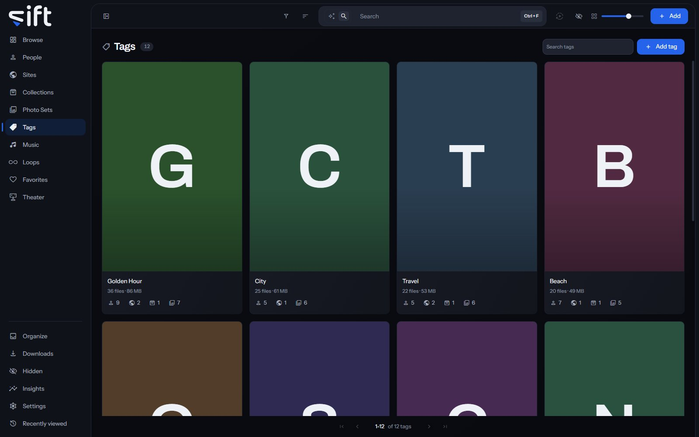

Tags lists every tag in your library, each with the files, people and Sites that carry it. To open it, click [Tags](/tags) in the sidebar.

A tag is a word you put on a file, a person, a Site, a collection or a Photo Set. Tags are shared by everyone who uses your library, so only an admin adds, renames or deletes one.

## Put a tag on something

On a file, choose **Add to** > **Tag** in its menu, then pick the tag. On a person's or Site's page, click **Add tag** under the name. On a wall of people, Sites, collections or Photo Sets, **Add to** > **Tag** tags every card you picked.

A stash-box can add tags too, when you enrich a file or a person from it. [Settings > Stash-boxes > Create new tags](/settings/stash-boxes#stash_boxes.invent.tag) decides whether it may make a tag you don't have yet.

## The Tags wall

Each card shows the tag's cover, or its first letter on a color, with how many files carry it and how much room they take. The marks under it count the people, Sites, collections and Photo Sets that carry it. **Search tags** finds a tag by its name or any of its aliases. **Add tag** makes a tag with a name and, if you like, a picture.

**Sort by** offers **Newest first**, **Oldest first**, **Recently edited**, **Name A-Z**, **Name Z-A**, **Most files**, **Fewest files**, **Favorites first** and **Highest rated**.

**Filter** opens these columns:

- **Category**: the group a tag belongs to.
- **Part of**: the broader tag a tag is filed under.
- **Enriched by**: which stash-box filled in the tag, or **Not enriched**.
- **Has a cover photo**: whether the tag has a cover.
- **Created by**: what made the tag: you, a stash-box or Sift.
- **Sharing status**: who the tag is shared with. Only an admin sees this column.
- **Stash-box disagreements**: tags whose stash-boxes give different answers. Only an admin sees this column.

## A tag's menu on the wall

Right-click a card, or select several, to open the menu. A tag can't carry a tag, so its menu has no Tag row:

- **Add to favorites**: adds the tag to your Favorites, or **Remove from favorites** takes it off.
- **Pin** or **Unpin**: keeps the tag at the top of the wall, or takes it off.
- **Rating**: gives the tag stars.
- **Rename**: gives the tag another name everywhere it's used.
- **Auto-enrich**: asks the stash-boxes about the tag and keeps an exact match. Its rows choose **All stash-boxes** or one box.
- **Enrich**: shows what the stash-boxes answer, so you choose the match yourself.
- **Don't enrich** or **Allow enrichment**: keeps the tag from being sent to any stash-box, or lets Sift ask about it again.
- **Hide** or **Unhide**: moves the tag into Hidden for you, or brings it back.
- **Share**: chooses the Users who see the tag.
- **Visibility**: shows who can reach the tag, and through what.
- **Delete**: takes the tag off every file carrying it. The files themselves aren't touched.

Only an admin sees Rename, the three stash-box rows, Share, Visibility and Delete.

## A tag's page

The page shows every file that carries the tag. Its tabs each show one side of it: **Files**, **Photo Sets**, **Loops**, **Tags**, **People**, **Sites**, **Collections**, **Music** and **History**. **Tags** shows the tags filed under this one.

**More** opens the whole record, and **Edit** turns it into a form:

- **Name**: the tag's name.
- **Aliases**: other words for the same thing. Searching for any of them finds this tag.
- **Part of**: the broader tag this one is filed under. Filtering by that tag finds this one too.
- **Category**: the group the tag belongs to.
- **Description**: what the tag means, so it's used the same way every time.
- **Stash-boxes**: the stash-box entries the tag is linked to.

On the **Files** tab, a tile's own row **Use as the cover** makes that file the tag's cover.

**Options** at the top of the page holds **Auto-enrich**, **Enrich**, **Don't enrich** and **Delete**, which do what they do on the wall.
