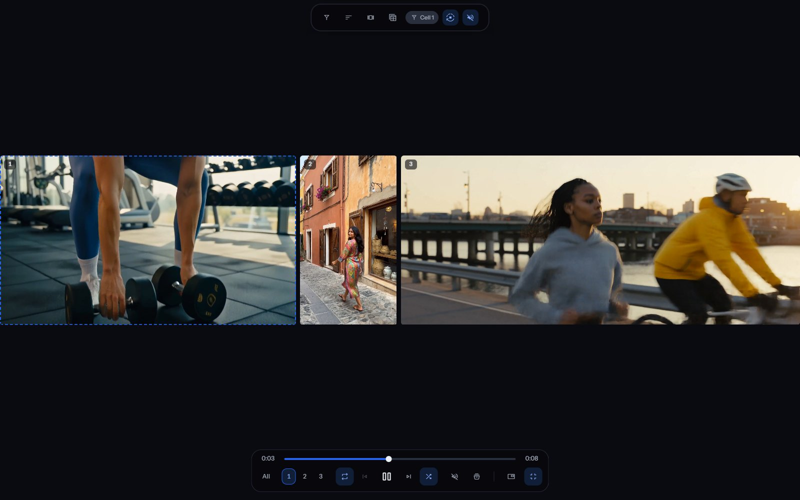

Theater plays several videos side by side, each cell drawing from a filter of its own. To open it, click [Theater](/theater) in the sidebar.

A wall holds up to nine cells. Each cell plays one file after another from what it plays, so a wall can run for as long as you leave it.

## The bar above the wall

The bar at the top of the window drives the whole wall:

- **Filter**: chooses what the selected cell plays. The chip beside it says which cell you're changing.
- **Sort by**: the order the selected cell plays in. It offers every order a file wall has, and **Shuffle again** while a cell is on **Random**.
- **Layouts**: the shape of the wall. See [Choose a layout](/library/theater/#choose-a-layout).
- **Saved Layouts**: opens your Saved Layouts. See [Keep a wall to open again](/library/theater/#keep-a-wall-to-open-again).
- **Play everything** and **Pause everything**: start or stop every cell and every timer together.
- **Mute everything** and **Unmute everything**: silence the whole wall, or bring its sound back.
- **Keyboard shortcuts**: the list of Theater's keys.

The bar under the wall drives one cell at a time. See [The bar under the wall](/library/theater/#the-bar-under-the-wall).

## Choose a layout

Click **Layouts** and choose a shape. Each shape is named rows by columns, except the two pairs, whose letter says which files they suit:

- **1x1**: one cell, which plays whatever its filter matches, one file after another.
- **1x2 (P)**: two cells side by side, for portrait files.
- **1x2 (L)**: two cells, one above the other, for landscape files.
- **1x3**: three cells side by side.
- **2x2**: four cells in two rows.
- **Center stage 1x1**, **1x2**, **1x3** and **2x2**: the same shapes, with a strip of up to five previews under them.

Point at a layout's name to see what its letter stands for.

A preview in the strip comes up onto the wall when you double-click it. To have it come up as soon as it starts something new, change [Settings > Playback > When a preview comes up](/settings/playback#theater.center_stage).

## The bar under the wall

Point at the foot of the wall to bring up its bar. The scrub line of the cell you're controlling runs along its top. The time so far is at the line's start, and the file's length at its end. Under it, from left to right:

- The cell numbers: choose which cell the bar controls. **All** (**Every cell**) points the bar at every cell together.
- **Play through**, **Repeat this** or **Stop at the end**: what the cell does when a file ends.
- **Previous**, **Play** or **Pause**, and **Next**.
- **Shuffle**: plays the cell's files in a shuffled order.
- **Mute** or **Unmute**, **More controls**, **Open mini player** and **Full screen**. **Open mini player** takes the whole wall into the mini player, so it keeps playing while you use the rest of Sift.

To change what a cell plays, use **Filter** on the bar above the wall, or **What it plays** in the cell's menu. **More controls** opens the cell's drawer:

- **Clip**: cuts a clip from the video playing.
- **Screenshot**: takes a picture of the frame on screen.
- **Quality**: the size the cell plays at, where the file has more than one.
- **Stats for nerds**: the file's technical details.
- **Randomize**: plays another file, picked at random from what the cell plays.
- **Set the loop start**, **Set the loop end** and **Clear the loop**: the three steps of one button that repeats a stretch.
- **Save as Loop**: saves the marked stretch to [Loops](/library/loops/#save-a-loop). It's unavailable until both ends are marked.
- **Hear only this**: mutes every other cell.
- **Video and GIF** or **Everything**: whether the cell plays pictures too.
- **Move on after**: how many seconds a cell holds a file before it plays the next.
- The preview mode, on a Center stage wall: whether a preview comes up when you double-click it or as soon as it starts something new.

## What a cell's menu does

Right-click a cell to open its menu:

- **Play** or **Pause**, **Previous** and **Next**: move through the cell's files.
- **Hear only this**: mutes every other cell.
- **Mute** or **Unmute**: the cell's own sound.
- **Move on after**: opens the cell's timer.
- **Shape**: the cell's frame: **Dynamic**, **Widescreen (16:9)**, **Portrait (9:16)**, **Square (1:1)**, **Classic (4:3)** or **Cinema (21:9)**.
- **What it plays**: chooses the cell's filter.
- **Add to**: adds the file playing to a Person, Site, Collection, Photo Set, Tag or Song, or to Favorites.
- **Copy filename**: copies the name of the file playing.
- **Rating**: rates the file playing.
- **Save to device**: saves a copy of the file playing to the device you're using.
- **Add a cell**: makes the wall one cell larger. A wall at its largest shape puts the new cell in the strip.
- **Close the strip**: takes the strip of previews away.
- **Duplicate cell**: adds another cell playing the same filter.
- **Move to the strip**: copies the cell into the strip as a preview.
- **Remove this feed**: takes the cell off the wall.

On a preview in the strip, the menu offers **Move to the wall**, **Remove this preview** and **Close the strip** instead.

## Keep a wall to open again

A Saved Layout keeps the wall's layout. For each cell, it keeps what it plays, its order, what happens at the end, its timer and its shape. It doesn't keep what each cell is playing or where, the loop marks, Quality, speed, the volume, or which cell has the sound. Click **Saved Layouts**, then **Save as new**, give it a name, and click **Save**.

Click a Saved Layout's picture to put that wall on screen. Its menu offers **Rename**, **Update from the wall on screen** and **Delete**.

## Keyboard shortcuts

Press **H** in Theater to see this list on screen:

| Key | What it does |
|---|---|
| 1 to 9 | Controls that cell. Press twice for its next file, three times for the one before. Hold for slow motion, hold the second press for faster, the third for backwards. |
| Backtick | Controls every cell together, with the same keys. |
| Space | Stops or starts the cell you're on. |
| Ctrl + Space | Stops everything, every timer included. |
| M | Mutes or unmutes the cell you're on. Hold it and use the arrows for its volume. |
| Ctrl + M | Mute everything, or Unmute everything. |
| M + Up, M + Down | Ten louder or ten quieter. |
| M + Right, M + Left | Two louder or two quieter. |
| Left, Right | Five seconds back or on. |
| Ctrl + Left, Ctrl + Right | The file before, or the next file, in this cell. |
| R | Repeat: off, the whole run, or this one file. |
| L | Marks the start of a loop, then its end, then clears it. |
| F | Full screen, or leave full screen. |
| I | Opens the wall in the mini player, or brings it back to full size. |
| H | Shows this list, and hides it again. |

## Theater on your phone

A phone's screen is too small for a wall, so on a phone the tab reads **Remote**. It drives the Theater walls and players open on your computer, signed in as you.

The Remote lists your **Screens**. Choose a wall to get its controls. The player row has every player bar's five controls: the repeat control, **Previous**, **Play**, **Next** and **Shuffle**. **Back 5 seconds** and **Forward 5 seconds** sit above them. They include **Play everything**, **Mute everything**, **Layouts** and **Saved Layouts**. **Cells** with **Every cell** chooses the cell, **One more** adds a cell, and **More controls** opens the drawer. **Full screen**, **Screenshot** and **Stats for nerds** need a press on your computer, so they're unavailable on the phone.

The Sift app on your computer offers its screens to the Remote. A browser tab offers them only after you turn on [Settings > Playback > Remote > Let your phone control this browser](/settings/playback#playback.remote.this_browser) in that browser.

## Theater settings

The settings that shape Theater are on the Playback pane:

- [Settings > Playback > Default layout when Theater opens](/settings/playback#theater.layout)
- [Settings > Playback > Start playing when Theater opens](/settings/playback#theater.autoplay)
- [Settings > Playback > Play the next file after](/settings/playback#theater.timer_seconds)
- [Settings > Playback > Pick up where you left off](/settings/playback#theater.resume)
- [Settings > Playback > When a preview comes up](/settings/playback#theater.center_stage)

With **Pick up where you left off** on, reloading the page brings the wall back too. Closing the window forgets it.
