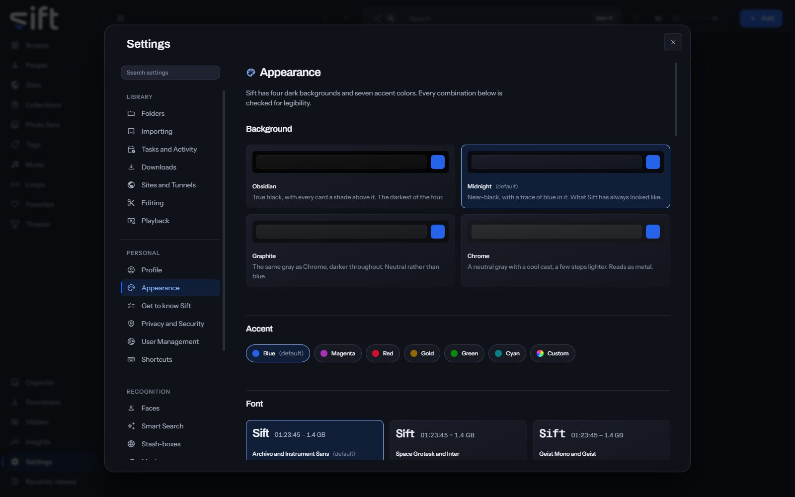

<!-- GENERATED by scripts/docs_generate.py from the settings registry and the client's sections.ts. Edit the source, never this page. -->

Appearance is where you choose how Sift looks to you: its colors, fonts, ratings, clock and the marks on a tile. To open it, go to [Settings > Appearance](/settings/appearance).

Come here to change the background or accent color, or to choose which pages the sidebar shows. Each User chooses for themselves.

## On this pane

The pane draws these groups, in this order:

- **Background**: four dark backgrounds, **Obsidian**, **Midnight**, **Graphite** and **Chrome**.
- **Accent**: seven accent colors and **Custom**.
- **Font**: six font pairings, then **Main** and **Secondary** to choose each font yourself.
- **Ratings**: **Five stars** or **Ten stars**.
- **Time**: a 12-hour or 24-hour clock.
- **Motion**: how much Sift animates. It's saved in this browser only.
- **People details**: how much of a person's record you see, and the units heights are shown in.
- **Marks on a tile**: when each mark appears. Select a mark on the picture, then choose **Always on the tile**, **Only when you point at it** or **Never**.
- **Sidebar**: which pages the sidebar shows, and their order. Drag a row by its grip to move it. It's saved in this browser only.

## Rows the pane draws by hand

- **Movement**: **Full motion**, **Follow Windows** or **Reduced motion**, for this browser.
- **Reset the sidebar**: **Reset** shows every page again, in the order Sift started with.

## Every setting

### Background

The color everything else sits on.

Obsidian is true black. Midnight is the near-black Sift has always used. Graphite and Chrome are the same neutral gray, one darker and one a little lighter.

- **Path**: [Settings > Appearance > Background](/settings/appearance#appearance.theme_base)
- **Default**: Midnight
- **Choices**: Obsidian, Midnight, Graphite, Chrome
- **Who sets it**: each User, for themselves

### Accent color

The color that marks what is selected, focused or playing.

The six named colors have the same brightness, so none is harder to see. Custom starts from a color you choose and is adjusted to stay just as legible.

- **Path**: [Settings > Appearance > Accent color](/settings/appearance#appearance.theme_accent)
- **Default**: Blue
- **Choices**: Blue, Magenta, Red, Gold, Green, Cyan, Custom
- **Who sets it**: each User, for themselves

### Custom accent color

The color a custom accent starts from, written as # and six digits. Used only while Accent color is Custom.

- **Path**: [Settings > Appearance > Custom accent color](/settings/appearance#appearance.theme_accent_hex)
- **Default**: #2563eb
- **Who sets it**: each User, for themselves

### Saved accent colors

Up to ten colors of your own, kept under the six named accents. Press one to wear it as your custom accent.

- **Path**: [Settings > Appearance > Saved accent colors](/settings/appearance#appearance.theme_accent_swatches)
- **Default**: empty
- **Who sets it**: each User, for themselves

### Main font

The typeface headings and numbers are set in. The sizes never change, only the shapes of the letters.

- **Path**: [Settings > Appearance > Main font](/settings/appearance#appearance.theme_face_display)
- **Default**: Archivo
- **Choices**: Archivo, Space Grotesk, Geist Mono, Manrope, JetBrains Mono
- **Who sets it**: each User, for themselves

### Secondary font

The typeface everything you read is set in: rows, help, the words on a button. Each of the six pairings sets both fonts, and you can change either one by itself.

- **Path**: [Settings > Appearance > Secondary font](/settings/appearance#appearance.theme_face_body)
- **Default**: Instrument Sans
- **Choices**: Instrument Sans, Inter, Geist, Public Sans, Sora, DM Sans
- **Who sets it**: each User, for themselves

### Clock

How Sift writes a time of day, such as when a file was added or a task last ran.

- **Path**: [Settings > Appearance > Clock](/settings/appearance#appearance.clock)
- **Default**: 12-hour
- **Choices**: 12-hour, 24-hour
- **Who sets it**: each User, for themselves

### Times watched

An eye and a number, on anything you have opened at least once.

- **Path**: [Settings > Appearance > Times watched](/settings/appearance#appearance.tile.views)
- **Default**: Only when I point at it
- **Choices**: Always, Only when I point at it, Never
- **Who sets it**: each User, for themselves

### O counter

A drop and a number, on anything you have pressed the O counter on.

- **Path**: [Settings > Appearance > O counter](/settings/appearance#appearance.tile.o_count)
- **Default**: Only when I point at it
- **Choices**: Always, Only when I point at it, Never
- **Who sets it**: each User, for themselves

### Pinned

A pin, on anything you have put at the top of a wall.

- **Path**: [Settings > Appearance > Pinned](/settings/appearance#appearance.tile.pinned)
- **Default**: Only when I point at it
- **Choices**: Always, Only when I point at it, Never
- **Who sets it**: each User, for themselves

### Shared or private

A badge on anything you have shared with a guest or kept private from one. It shows that a choice was made, never who it was about.

- **Path**: [Settings > Appearance > Shared or private](/settings/appearance#appearance.tile.sharing)
- **Default**: Only when I point at it
- **Choices**: Always, Only when I point at it, Never
- **Who sets it**: each User, for themselves

### Hidden

A crossed-out eye, on anything you keep out of the ordinary view.

- **Path**: [Settings > Appearance > Hidden](/settings/appearance#appearance.tile.hidden)
- **Default**: Only when I point at it
- **Choices**: Always, Only when I point at it, Never
- **Who sets it**: each User, for themselves

### Heart

The heart you press to like a file. When off, you can still like a file from the file itself or from its menu.

- **Path**: [Settings > Appearance > Heart](/settings/appearance#appearance.tile.favorite)
- **Default**: Only when I point at it
- **Choices**: Always, Only when I point at it, Never
- **Who sets it**: each User, for themselves

### Rating

The rating you gave a file, beside the heart. You rate a file on the file itself.

- **Path**: [Settings > Appearance > Rating](/settings/appearance#appearance.tile.rating)
- **Default**: Only when I point at it
- **Choices**: Always, Only when I point at it, Never
- **Who sets it**: each User, for themselves

### The word GIF

In the corner of a looping picture, where a video shows its length.

- **Path**: [Settings > Appearance > The word GIF](/settings/appearance#appearance.tile.gif)
- **Default**: Always
- **Choices**: Always, Only when I point at it, Never
- **Who sets it**: each User, for themselves

### Duration

The clock in the bottom corner of a video.

- **Path**: [Settings > Appearance > Duration](/settings/appearance#appearance.tile.duration)
- **Default**: Always
- **Choices**: Always, Only when I point at it, Never
- **Who sets it**: each User, for themselves

### Rating scale

How many stars a rating shows.

There are no half stars, and ratings you already gave keep their meaning.

- **Path**: [Settings > Appearance > Rating scale](/settings/appearance#ratings.scale)
- **Default**: Five stars
- **Choices**: Five stars, Ten stars
- **Who sets it**: each User, for themselves

### Show every field on a record

When off, a record shows only its main fields.

The extra fields are ones only a stash-box fills in, like eye color and height. Nothing is saved or deleted either way.

- **Path**: [Settings > Appearance > Show every field on a record](/settings/appearance#records.show_every_field)
- **Default**: On
- **Who sets it**: each User, for themselves

### Units

How heights are shown. Sift stores them in centimeters either way.

- **Path**: [Settings > Appearance > Units](/settings/appearance#appearance.units)
- **Default**: Feet and inches
- **Choices**: Centimeters, Feet and inches
- **Who sets it**: each User, for themselves
