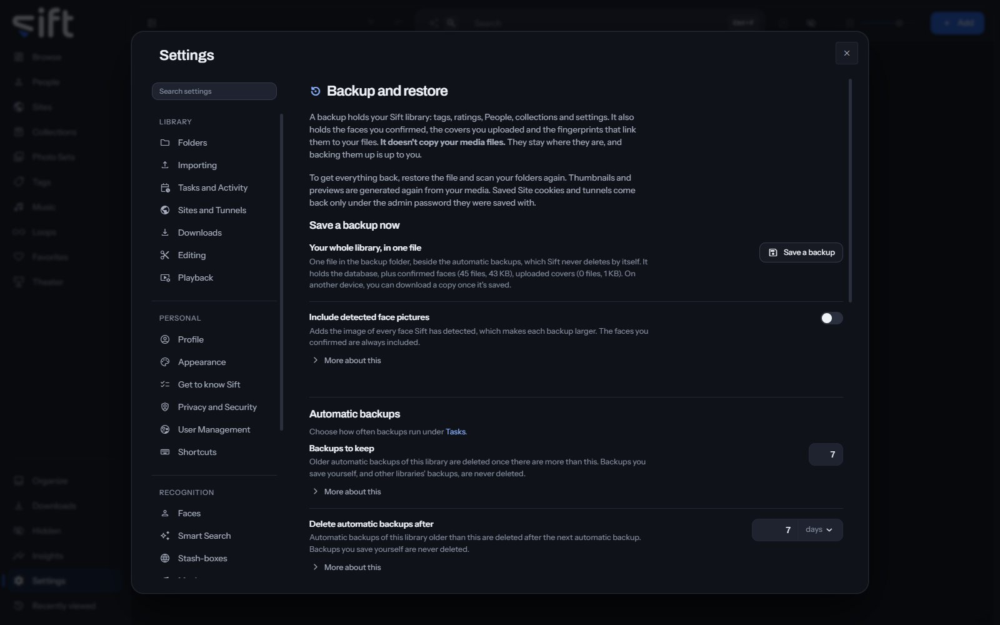

<!-- GENERATED by scripts/docs_generate.py from the settings registry and the client's sections.ts. Edit the source, never this page. -->

Backup and restore is where you save your Sift library to one file, choose automatic backups, and open other libraries. To open it, go to [Settings > Backup and restore](/settings/backup).

Come here to save a backup before a big change, or to restore one. A backup holds your tags, ratings, People, collections, settings and confirmed faces, never your media files.

## On this pane

The pane draws these groups, in this order:

- **Save a backup now**: **Save a backup** saves your whole library as one file in the backup folder. Sift never deletes it by itself.
- **Automatic backups**: how many to keep, how long to keep them, and the backup folder. Each saves the moment it changes. How often they run is chosen in [Settings > Tasks and Activity](/settings/tasks#tasks.backup.when).
- **Restore from a backup**: **Choose a backup file** replaces your whole Sift library with what is in the file. Your media files aren't touched.
- **Libraries**: Sift opens one library at a time. **Open** restarts Sift on another library, for everyone using it.

## Rows the pane draws by hand

- **Backups Sift leaves alone**: backups you saved, or whose names don't say which library made them. **Delete** deletes one.
- **New library**: **Create and open** starts an empty library with you as its admin.
- **Duplicate this library**: **Duplicate** creates a second library from this one, with the same Users and passwords.
- **Migrate from Stash**: **Choose** picks Stash's database, and **Read it** reads a copy. Nothing changes until you say so.
- **Import a database file**: **Choose a file** makes a backup or a Sift database into a new library of its own.

The menu on another library offers **Open this one when Sift starts**, **Open the last one used instead**, **Remove from this list** and **Delete**.

## Every setting

### Backups to keep

Older automatic backups of this library are deleted once there are more than this. Backups you save yourself, and other libraries' backups, are never deleted.

Sift only deletes a backup whose name shows it came from this library. Backups made by an older version of Sift don't show that, so they stay until you remove them.

- **Path**: [Settings > Backup and restore > Backups to keep](/settings/backup#backup.keep)
- **Default**: 7
- **Range**: 1 to 60
- **Who sets it**: an admin, for everyone on this Sift

### Delete automatic backups after

Automatic backups of this library older than this are deleted after the next automatic backup. Backups you save yourself are never deleted.

Leave it empty to keep automatic backups however old they are; the number above still applies.

- **Path**: [Settings > Backup and restore > Delete automatic backups after](/settings/backup#backup.keep_days)
- **Default**: 7 days
- **Range**: Never to 3650 days
- **Who sets it**: an admin, for everyone on this Sift

### Backup folder

Choose a folder on another drive, outside your libraries. With none chosen, backups are kept in the same folder as Sift's own data.

- **Path**: [Settings > Backup and restore > Backup folder](/settings/backup#backup.folder)
- **Default**: empty
- **Who sets it**: an admin, for everyone on this Sift

### Include detected face pictures

Adds the image of every face Sift has detected, which makes each backup larger. The faces you confirmed are always included.

Identify now finds these faces again from your media, so they aren't needed to get your library back.

- **Path**: [Settings > Backup and restore > Include detected face pictures](/settings/backup#backup.include_detected_faces)
- **Default**: Off
- **Who sets it**: an admin, for everyone on this Sift
