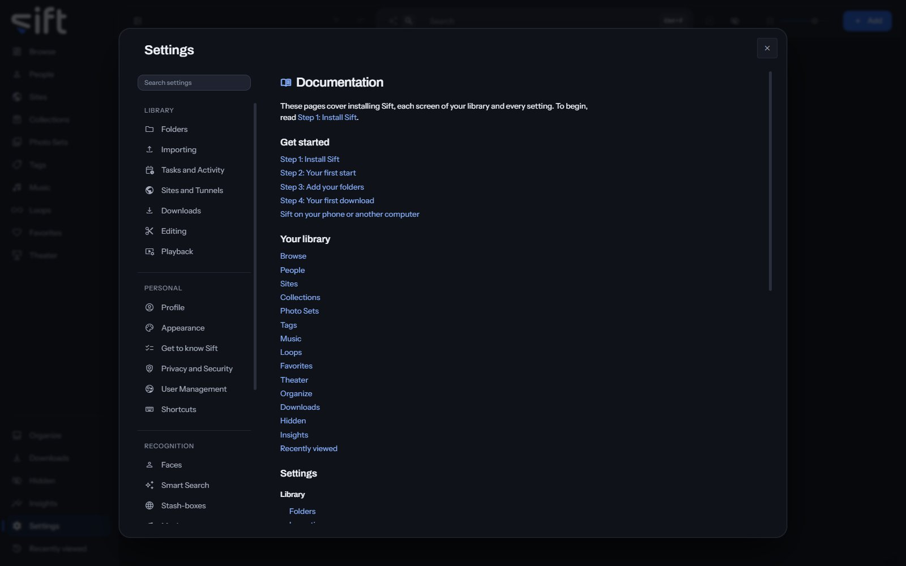

<!-- GENERATED by scripts/docs_generate.py from the settings registry and the client's sections.ts. Edit the source, never this page. -->

Documentation is these pages, inside Sift: installing it, each screen of your library and every setting, for the version you run. To open it, go to [Settings > Documentation](/settings/documentation).

Come here to read how something works without leaving Sift. The pages need no internet, and a link to a place in Sift opens it.

Nothing on this pane is a stored setting.
