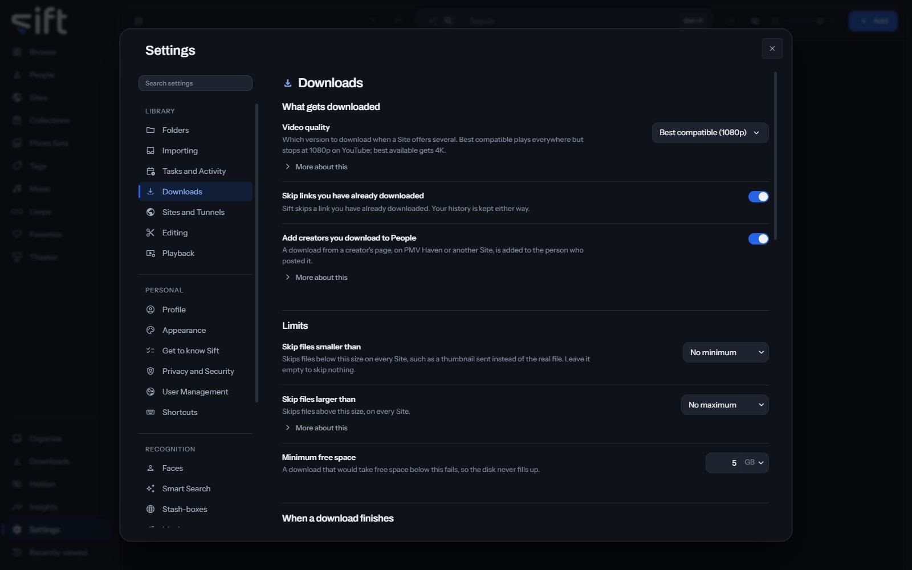

<!-- GENERATED by scripts/docs_generate.py from the settings registry and the client's sections.ts. Edit the source, never this page. -->

Downloads is where you choose how Sift downloads from a link: the quality, the limits, where files land and what they're named. To open it, go to [Settings > Downloads](/settings/downloads).

Come here to set a download folder, a name template or a size limit. Sift downloads videos with yt-dlp and galleries of photos with gallery-dl.

## On this pane

The pane draws these groups, in this order:

- **What gets downloaded**: the video quality, skipping links you already downloaded, and adding creators to People.
- **Limits**: the smallest and largest file to keep, and the free space to leave on the disk.
- **When a download finishes**: the message and the sound.
- **Folders and file names**: the download folder, the name template and its presets.
- **Per-Site settings**: settings of a Site's own.

## Rows the pane draws by hand

- **Download folder**: where a download lands when you don't choose a folder for it. **Choose a folder** sets it.
- **Name template for other addresses**: the file name for a link from an address Sift has no Site for.
- **Name presets**: a ready-made rule. Choosing one fills the template.
- **Give a Site its own settings**: **Select a Site** to give it its own folder, name template or downloader.
- **More settings**: **Edit** opens how many downloads run at the same time, the speed limit, the wait between requests, retries and time-outs.

## What a name template can hold

Choose one of these to add it to the name:

- `{site}`: the Site it came from.
- `{creator}`: whoever posted it, where the Site says.
- `{name}`: the name the file already had, which is usually the Site's own title for it.
- `{date}`: the date it was downloaded.
- `{time}`: the time it was downloaded.
- `{id}`: the post's own ID on the Site.
- `{n}`: which file of the post it is, as 1, 2, 3.
- `{title}`: the post's title or caption, where the Site has one.
- `{posted}`: the date it was posted, where the Site says.

## Every setting

### Add creators you download to People

A download from a creator's page, on PMV Haven or another Site, is added to the person who posted it.

Only on Sites where a username belongs to a person, such as PMV Haven, TikTok, Instagram and YouTube. A subreddit never becomes a person.

- **Path**: [Settings > Downloads > Add creators you download to People](/settings/downloads#download.people_from_usernames)
- **Default**: On
- **Who sets it**: an admin, for everyone on this Sift

### Skip links you have already downloaded

Sift skips a link you have already downloaded. Your history is kept either way.

- **Path**: [Settings > Downloads > Skip links you have already downloaded](/settings/downloads#download.remember)
- **Default**: On
- **Who sets it**: an admin, for everyone on this Sift

### Downloads at the same time

How many downloads run at the same time.

- **Path**: [Settings > Downloads > Downloads at the same time](/settings/downloads#download.at_once)
- **Default**: Default
- **Range**: Default to 32
- **Who sets it**: an admin, for everyone on this Sift

### Minimum free space

A download that would take free space below this fails, so the disk never fills up.

- **Path**: [Settings > Downloads > Minimum free space](/settings/downloads#download.min_free_gb)
- **Default**: 5 GB
- **Range**: 1 to 1000 GB
- **Who sets it**: an admin, for everyone on this Sift

### Play a sound when finished

Plays a short tone when a download finishes, fails or needs you to sign in.

- **Path**: [Settings > Downloads > Play a sound when finished](/settings/downloads#download.sound)
- **Default**: Off
- **Who sets it**: each User, for themselves

### Sound volume

How loud those tones are.

- **Path**: [Settings > Downloads > Sound volume](/settings/downloads#download.sound_volume)
- **Default**: 40 %
- **Range**: 0 to 100 %
- **Who sets it**: each User, for themselves

### Say when a download finishes

Shows a message on any screen when downloads finish.

Each download names every file as it finishes, with Open once it's in your library. Once for many waits until nothing is left downloading, then shows one message: the file's name when only one finished, or how many did. The sound is a separate setting.

- **Path**: [Settings > Downloads > Say when a download finishes](/settings/downloads#download.finished_message)
- **Default**: Off
- **Choices**: Off, Each download, Once for many
- **Who sets it**: each User, for themselves

### Pause downloads

Nothing new starts while this is on.

Downloads already running finish. A transfer can't be paused halfway and resumed later.

- **Path**: [Settings > Downloads > Pause downloads](/settings/downloads#download.paused)
- **Default**: Off
- **Who sets it**: an admin, for everyone on this Sift

### Wait between requests

A pause between one request and the next, on every Site. 0 sends them without a pause.

- **Path**: [Settings > Downloads > Wait between requests](/settings/downloads#download.pace_ms)
- **Default**: 500 ms
- **Range**: 0 to 10000 ms
- **Who sets it**: an admin, for everyone on this Sift

### Retries per download

How many times Sift retries a failed download, on every Site. 0 means it doesn't retry.

- **Path**: [Settings > Downloads > Retries per download](/settings/downloads#download.retries)
- **Default**: 3
- **Range**: 0 to 10
- **Who sets it**: an admin, for everyone on this Sift

### Stopped responding for

How long Sift waits on a download that has stopped sending anything before it gives up on that try. Applies to every Site.

Raise it on a slow connection. Lower it if stuck downloads are holding up the others. A Site that never answers costs one wait rather than one for every retry, and a download that stalls partway through is tried again.

- **Path**: [Settings > Downloads > Stopped responding for](/settings/downloads#download.timeout_seconds)
- **Default**: 30 sec
- **Range**: 5 to 600 sec
- **Who sets it**: an admin, for everyone on this Sift

### Wait after a rate limit

How long Sift waits before downloading from a Site again when it says it has too many requests. Applies to every Site.

- **Path**: [Settings > Downloads > Wait after a rate limit](/settings/downloads#download.backoff_seconds)
- **Default**: 60 sec
- **Range**: 5 to 3600 sec
- **Who sets it**: an admin, for everyone on this Sift

### Download speed limit

Limits how fast each download can go, on every Site. Leave it empty for no limit.

- **Path**: [Settings > Downloads > Download speed limit](/settings/downloads#download.bandwidth_kbps)
- **Default**: No limit
- **Range**: No limit to 1000000 KB/s
- **Who sets it**: an admin, for everyone on this Sift

### Skip files smaller than

Skips files below this size on every Site, such as a thumbnail sent instead of the real file. Leave it empty to skip nothing.

- **Path**: [Settings > Downloads > Skip files smaller than](/settings/downloads#download.skip_smaller_mb)
- **Default**: No minimum
- **Range**: No minimum to 100000 MB
- **Who sets it**: an admin, for everyone on this Sift

### Skip files larger than

Skips files above this size, on every Site.

Leave it empty to skip nothing. Sift goes by the size a Site states in advance, so use Minimum free space to protect your disk.

- **Path**: [Settings > Downloads > Skip files larger than](/settings/downloads#download.skip_larger_mb)
- **Default**: No maximum
- **Range**: No maximum to 1000000 MB
- **Who sets it**: an admin, for everyone on this Sift

### Video quality

Which version to download when a Site offers several. Best compatible plays everywhere but stops at 1080p on YouTube; best available gets 4K.

Best compatible picks H.264 video in an MP4 file, which plays in every browser and on every device, and on YouTube it stops at 1080p. Best available picks the highest resolution and frame rate on offer, often in the newer AV1 or VP9 formats that some older devices can't play. When a Site doesn't offer the version you prefer, the best one it does offer is taken, and some Sites offer only one. Nothing converts a download, so the file is kept exactly as the Site sent it.

- **Path**: [Settings > Downloads > Video quality](/settings/downloads#download.quality)
- **Default**: Best compatible (1080p)
- **Choices**: Best compatible (1080p), Best available (4K)
- **Who sets it**: an admin, for everyone on this Sift
