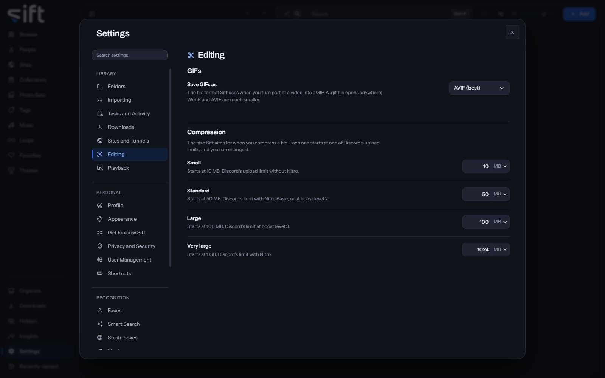

<!-- GENERATED by scripts/docs_generate.py from the settings registry and the client's sections.ts. Edit the source, never this page. -->

Editing is where you choose the format of a GIF you make and the sizes Sift compresses a file to. To open it, go to [Settings > Editing](/settings/editing).

Come here to change the size a compression preset aims for. Each preset starts at one of Discord's upload limits, and you can change it.

## On this pane

The pane draws two groups:

- **GIFs**: the file format of a GIF you make from part of a video.
- **Compression**: the four sizes, **Small**, **Standard**, **Large** and **Very large**, that **Compress** offers on a file.

## Every setting

### Save GIFs as

The file format Sift uses when you turn part of a video into a GIF. A .gif file opens anywhere; WebP and AVIF are much smaller.

- **Path**: [Settings > Editing > Save GIFs as](/settings/editing#edit.gif_format)
- **Default**: AVIF (best)
- **Choices**: GIF (largest), WebP (balanced), AVIF (best)
- **Who sets it**: an admin, for everyone on this Sift

### Small

Starts at 10 MB, Discord's upload limit without Nitro.

- **Path**: [Settings > Editing > Small](/settings/editing#compress.target_small_mb)
- **Default**: 10 MB
- **Range**: 1 to 100000 MB
- **Who sets it**: an admin, for everyone on this Sift

### Standard

Starts at 50 MB, Discord's limit with Nitro Basic, or at boost level 2.

- **Path**: [Settings > Editing > Standard](/settings/editing#compress.target_standard_mb)
- **Default**: 50 MB
- **Range**: 1 to 100000 MB
- **Who sets it**: an admin, for everyone on this Sift

### Large

Starts at 100 MB, Discord's limit at boost level 3.

- **Path**: [Settings > Editing > Large](/settings/editing#compress.target_large_mb)
- **Default**: 100 MB
- **Range**: 1 to 100000 MB
- **Who sets it**: an admin, for everyone on this Sift

### Very large

Starts at 1 GB, Discord's limit with Nitro.

- **Path**: [Settings > Editing > Very large](/settings/editing#compress.target_very_large_mb)
- **Default**: 1024 MB
- **Range**: 1 to 100000 MB
- **Who sets it**: an admin, for everyone on this Sift
