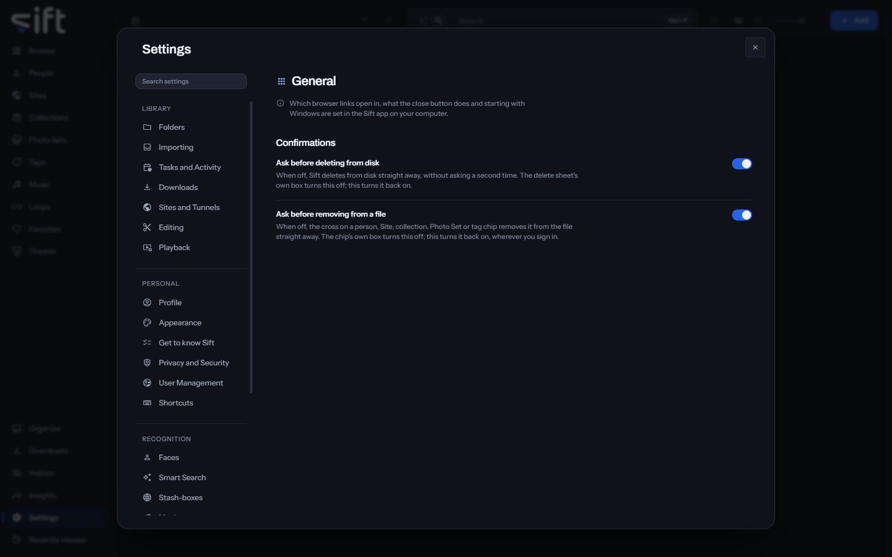

<!-- GENERATED by scripts/docs_generate.py from the settings registry and the client's sections.ts. Edit the source, never this page. -->

General is where you choose the confirmations Sift shows, and in the Sift app, how Sift starts and closes. To open it, go to [Settings > General](/settings/general).

Come here to turn a confirmation back on, or to share your library with other devices on your network. Which browser links open in, what the close button does and starting with Windows are set in the Sift app on your computer.

## On this pane

The pane draws one group in a browser, and more in the Sift app:

- **Confirmations**: whether you confirm before Sift deletes from disk, and before it removes a person, Site, collection, Photo Set or tag from a file.
- **Links**: in the Sift app, which browser Sift opens a link with.
- **Closing the window**: in the Sift app, whether closing the window leaves Sift running in the notification area.
- **Start Sift when Windows starts**: in the Sift app, whether Sift starts each time you sign in to Windows.
- **Share this library on my network**: in the Sift app, whether other devices on your network can open Sift.
- **Library location**: in the Sift app, whether your library is on your computer or on another computer Sift connects to. Changing it moves nothing.
- **The computer running Sift**: from another device, the settings of the computer your library is on, with **Firewall** and **Open the firewall port**.

## Rows the pane draws by hand

- **Run setup again**: the next time you open Sift, it asks whether your computer keeps the library or connects to another computer. It doesn't ask where your library is, and nothing is moved or deleted.
- **Restart Sift**: Sift closes and opens again.

Nothing on this pane is a stored setting.
