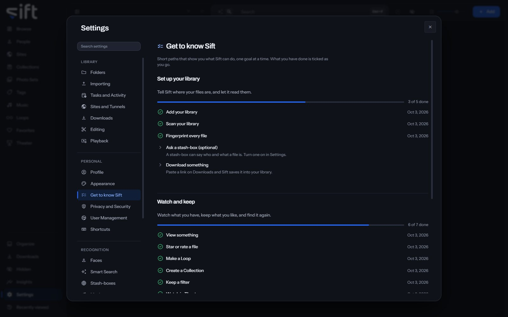

<!-- GENERATED by scripts/docs_generate.py from the settings registry and the client's sections.ts. Edit the source, never this page. -->

Get to know Sift is a set of short paths that show you what Sift can do, one goal at a time. To open it, go to [Settings > Get to know Sift](/settings/get-to-know).

Come here to see what you have tried and what to try next. Each step is ticked when you do it, wherever you do it.

## On this pane

Nothing on this pane is a setting. It draws three paths, each with its steps:

- **Set up your library**: add your library, scan it, fingerprint every file, ask a stash-box and download something.
- **Watch and keep**: view something, star or rate a file, make a Loop, create a Collection, keep a filter and watch in Theater.
- **Organize with Sift**: review a folder, name a face, clear a group on Organize, and name 100 and then 1,000 faces.

A step you've done shows the day you did it.

Nothing on this pane is a stored setting.
