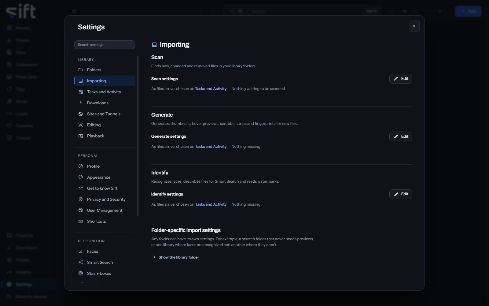

<!-- GENERATED by scripts/docs_generate.py from the settings registry and the client's sections.ts. Edit the source, never this page. -->

Importing is where you choose what Sift does with each file as it arrives: Scan, Generate and Identify. To open it, go to [Settings > Importing](/settings/importing).

Come here to choose what each stage makes, such as hover previews or Photo Sets, or to give one folder settings of its own. When each stage runs is chosen in [Settings > Tasks and Activity](/settings/tasks).

## On this pane

The pane draws one group for each stage, in the order Sift runs them:

- **Scan**: finds new, changed and removed files in your library folders. **Edit** opens its settings.
- **Generate**: makes thumbnails, hover previews, scrubber strips and fingerprints for new files. **Edit** opens its settings.
- **Identify**: recognizes faces, describes files for Smart Search and reads watermarks. **Edit** opens its settings, and the three recognition switches.
- **Folder-specific import settings**: gives one library folder its own settings, or lets it follow the default. **Edit** beside a folder opens them.

Each stage's row says when it runs and whether anything is waiting for it.

## Every setting

### Create Photo Sets from folders

A folder with 10 or more photos and no videos becomes a Photo Set named after the folder.

- **Path**: [Settings > Importing > Create Photo Sets from folders](/settings/importing#photo_sets.from_folders)
- **Default**: On
- **Who sets it**: an admin, for everyone on this Sift

### Create Photo Sets from ZIP files

A ZIP file with 10 or more photos inside becomes a Photo Set named after the file.

- **Path**: [Settings > Importing > Create Photo Sets from ZIP files](/settings/importing#photo_sets.from_archives)
- **Default**: On
- **Who sets it**: an admin, for everyone on this Sift

### Generate fingerprints

Generates the fingerprint that finds duplicates and matches a file on the stash-boxes.

When off, new files aren't fingerprinted, so they can't be matched on the stash-boxes or found as duplicates. To catch up, turn this on and choose Generate now.

- **Path**: [Settings > Importing > Generate fingerprints](/settings/importing#performance.generate_fingerprints)
- **Default**: On
- **Who sets it**: an admin, for everyone on this Sift

### Generate hover previews

Generates the short clip that plays when you hover over a video.

Hover previews use the most CPU, so turning them off saves the most on a busy scan. Videos still play in full when you open them.

- **Path**: [Settings > Importing > Generate hover previews](/settings/importing#performance.generate_previews)
- **Default**: On
- **Who sets it**: an admin, for everyone on this Sift

### Hover preview length

A long video is sampled across its whole length. A short one plays from the beginning.

Both cut to a new moment every 1.5 seconds. Changing this generates every preview again in the background.

- **Path**: [Settings > Importing > Hover preview length](/settings/importing#performance.preview_shape)
- **Default**: 12 seconds
- **Choices**: 6 seconds, 12 seconds
- **Who sets it**: an admin, for everyone on this Sift

### Generate scrubber strips

Generates the row of frames you see while dragging along a video.

When off, the scrubber still works but can't show where you are dragging to.

- **Path**: [Settings > Importing > Generate scrubber strips](/settings/importing#performance.generate_sprites)
- **Default**: On
- **Who sets it**: an admin, for everyone on this Sift

### Repair videos that stutter when skipping

Some files store their sound far from their picture, which makes skipping around stutter.

Sift keeps a corrected copy and plays that instead. Your own file is never changed. Each copy is a whole second file, so turning this off stops new ones and keeps the ones already made. To free that space, delete them in [Settings > Maintenance](/settings/maintenance).

- **Path**: [Settings > Importing > Repair videos that stutter when skipping](/settings/importing#performance.repair_playback)
- **Default**: On
- **Who sets it**: an admin, for everyone on this Sift

### Create Photo Sets from shoots

A shoot is a run of one creator's photos taken together: the same place, light and outfit. When on, each one Sift finds becomes a Photo Set.

When off, each suggested shoot waits in Organize under Shoots until you choose Create Photo Set. When on, every shoot becomes a Photo Set as soon as Sift finds it. Each one is recorded in History, where you can undo it.

- **Path**: [Settings > Importing > Create Photo Sets from shoots](/settings/importing#shoots.auto_file)
- **Default**: Off
- **Who sets it**: an admin, for everyone on this Sift

### Find usernames in photo details

When a file is named with a Site's ID for a username, Sift looks in the photo's details for the name.

Sift checks only two fields, Artist and ImageDescription, in a few of that username's photos. It checks them only when no username in your library matches the ID. It never reads a location or anything else in the file. When off, those files wait until you add the ID to a username yourself, and nothing already added is undone.

- **Path**: [Settings > Importing > Find usernames in photo details](/settings/importing#suggestions.read_metadata)
- **Default**: On
- **Who sets it**: an admin, for everyone on this Sift

### Add usernames from filenames

When a filename shows the Site and username a file came from, as downloaders name them, Sift adds that Site and username to the file.

When off, Sift ignores filenames, and Sites and usernames already added stay. It uses only the name, so it adds almost no time to a scan, and it never adds People.

- **Path**: [Settings > Importing > Add usernames from filenames](/settings/importing#suggestions.file_from_filenames)
- **Default**: On
- **Who sets it**: an admin, for everyone on this Sift
