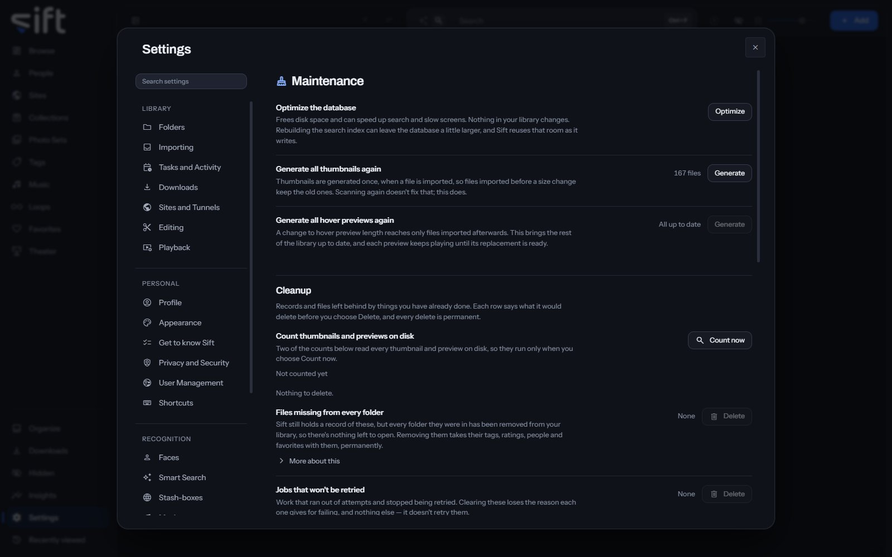

<!-- GENERATED by scripts/docs_generate.py from the settings registry and the client's sections.ts. Edit the source, never this page. -->

Maintenance is where you tidy Sift's own data: the database, the thumbnails and previews, and the files Sift couldn't import. To open it, go to [Settings > Maintenance](/settings/maintenance).

Come here to free disk space or to bring old thumbnails and previews up to date. Every row says what it would delete before you choose **Delete**, and every delete is permanent.

## On this pane

The first rows have no heading. Then the pane draws two groups:

- **Cleanup**: records and files left behind by things you have already done, one row for each kind, each with **Delete**.
- **Quarantined files**: files Sift couldn't import. Review them in Organize, and choose how many days to keep them.

## Rows the pane draws by hand

- **Optimize the database**: **Optimize** frees disk space and can speed up search and slow screens. Nothing in your library changes.
- **Generate all thumbnails again**: **Generate** makes every thumbnail again, so files imported before a size change get new ones.
- **Generate all hover previews again**: **Generate** brings every hover preview up to the length you chose.
- **Count thumbnails and previews on disk**: **Count now** reads every thumbnail and preview on disk for the counts below.

The **Cleanup** rows, one for each kind of leftover, each with **Delete**:

- Records of files whose folders were all removed from your library.
- Work that ran out of attempts and stopped being retried.
- **Leftover thumbnails and previews**: pictures made from files Sift doesn't have now.
- **Repackaged copies of videos**: second copies kept so videos skip smoothly, offered while repair is off.
- Descriptions Smart Search kept of files that left your library.
- Descriptions from a model you switched away from.
- **Face pictures from earlier scans**: cropped faces no screen shows any more.
- Samples made while you chose how much to compress a file.

The duplicate settings listed under **Every setting** are drawn on Organize, on the **Near duplicates** card, beside the groups they decide.

## Every setting

### Delete quarantined files after

Files Sift couldn't import are kept in a folder of their own, so you can review them.

It's off to begin with. Sift quarantines a file it can't read, which is as often a half-finished download as a damaged file. Enter a number of days to delete quarantined files automatically, or leave it empty to keep every file until you delete it yourself.

- **Path**: [Settings > Maintenance > Delete quarantined files after](/settings/maintenance#quarantine.keep_days)
- **Default**: Never
- **Range**: Never to 3650 days
- **Who sets it**: an admin, for everyone on this Sift

### Delete quarantined files

Deletes quarantined files once they are older than the number of days you set.

- **Path**: [Settings > Maintenance > Delete quarantined files](/settings/maintenance#maintenance.quarantine)
- **Default**: During quiet hours
- **Choices**: On a schedule, During quiet hours, Only when I press it
- **Who sets it**: an admin, for everyone on this Sift

### How similar duplicates must be

How close two files must be before Sift shows them as duplicates.

Each level is a count of how much of the fingerprint differs, which means something different for each kind of file. For a video, exact is 0, high is 2, medium is 4 and low is 6, where unrelated videos start to look alike. For a photograph the loosest level reaches 11, because two different pictures measure at least 26 apart. For a GIF it counts frames, and the loosest level lets 6 of its 30 frames differ.

- **Path**: [Settings > Maintenance > How similar duplicates must be](/settings/maintenance#dedup.level)
- **Default**: Medium: very similar
- **Choices**: Exact: identical, High: almost identical, Medium: very similar, Low: similar
- **Who sets it**: an admin, for everyone on this Sift

### Which copy to keep

The copy Sift suggests keeping in each group of duplicates. Nothing is deleted until you confirm it.

Each rule is tried first, not alone. Two re-encodes of one clip often have the same size and resolution, so a tie goes to the next rule. Only a group that no rule can separate is left for you to decide. Higher resolution is the default because it best survives a re-encode: a re-compressed copy is smaller and newer but no better to look at.

- **Path**: [Settings > Maintenance > Which copy to keep](/settings/maintenance#dedup.keep)
- **Default**: Higher resolution
- **Choices**: Higher resolution, Larger file, Smaller file, Newer, Older
- **Who sets it**: an admin, for everyone on this Sift

### Largest difference in length

Two copies of one video run about the same length, so a bigger gap is usually a coincidence.

Leave it empty to ignore length. Videos Sift hasn't measured yet are always shown.

- **Path**: [Settings > Maintenance > Largest difference in length](/settings/maintenance#dedup.max_duration_gap_seconds)
- **Default**: 10 sec
- **Range**: No limit to 3600 sec
- **Who sets it**: an admin, for everyone on this Sift
