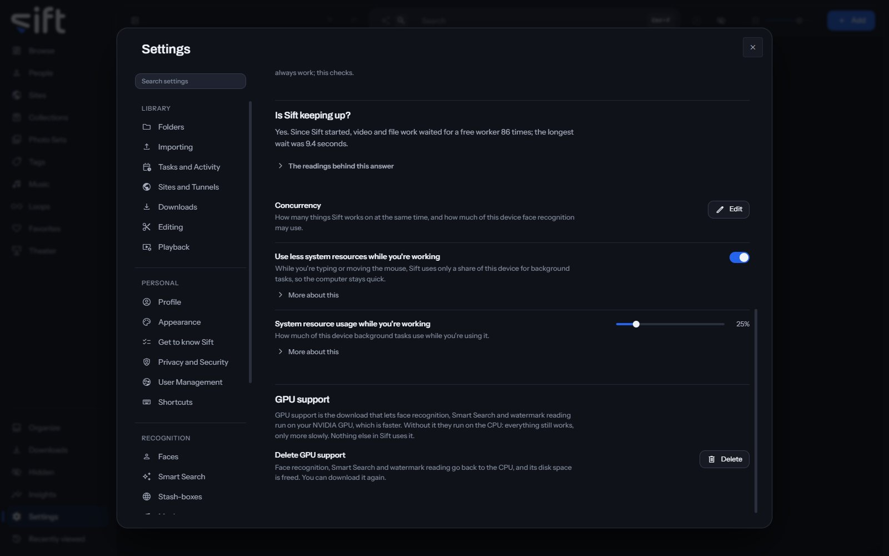

<!-- GENERATED by scripts/docs_generate.py from the settings registry and the client's sections.ts. Edit the source, never this page. -->

Performance is where you see what your computer is, how much Sift does on it at the same time, and how Sift is keeping up. To open it, go to [Settings > Performance](/settings/performance).

Come here to benchmark your computer, to download GPU support, or to change how much Sift does at the same time.

## On this pane

The pane draws these groups, in this order:

- **Device running Sift**: its CPU, threads, memory, GPU, driver and video encoders, and what face recognition, Smart Search and converting video run on. **Copy this device's details** copies them.
- **GPU**: whether Sift can use an NVIDIA GPU. **Download the GPU runtime** downloads GPU support, and **Test the GPU** checks that a real model runs on it.
- **Benchmarking this device**: **Benchmark this device** measures what your computer can do and suggests how many things Sift does at the same time.
- **Is Sift keeping up?**: whether Sift has stopped responding since it started, with the readings behind the answer. **For a bug report** holds the tables to copy into a report.
- **GPU support**: **Delete GPU support** sends face recognition, Smart Search and watermark reading back to the CPU and frees the disk space.

## Rows the pane draws by hand

- **Concurrency**: **Edit** opens how many tasks, previews and folder scans run at the same time, and how much of your computer face recognition may use.
- **Restart Sift**: shown after GPU support is downloaded, because Sift loads the GPU runtime only when it starts.

The rows below under **Every setting** are on the pane itself and on the Concurrency page behind **Edit**.

## Every setting

### How much recognition uses

How much of this device face recognition uses.

Share uses the share below. Fixed number checks as many files at the same time as you choose. When recognition runs is set under Tasks.

- **Path**: [Settings > Performance > How much recognition uses](/settings/performance#faces.machine_budget)
- **Default**: Share
- **Choices**: Share, Fixed number
- **Who sets it**: an admin, for everyone on this Sift

### Share of this device to use

Using all of it slows other apps.

While you're working, this is a share of the amount Sift uses then. That amount is set in [Settings > Performance > System resource usage while you're working](/settings/performance#performance.step_back_share).

- **Path**: [Settings > Performance > Share of this device to use](/settings/performance#faces.core_share)
- **Default**: 50 %
- **Range**: 10 to 100 %
- **Who sets it**: an admin, for everyone on this Sift

### Files searched at the same time

Used with Fixed number, whatever else this device is doing.

Choose a number only if you have measured this device and want a different one from Sift's.

- **Path**: [Settings > Performance > Files searched at the same time](/settings/performance#faces.thread_count)
- **Default**: Automatic
- **Range**: Automatic to 64
- **Who sets it**: an admin, for everyone on this Sift

### Tasks at the same time

How many background tasks Sift runs at the same time, such as scans and thumbnails.

Automatic chooses from your CPU, which is usually right. A change takes effect within seconds, with no restart.

- **Path**: [Settings > Performance > Tasks at the same time](/settings/performance#performance.worker_count)
- **Default**: Automatic
- **Range**: Automatic to 64
- **Who sets it**: an admin, for everyone on this Sift

### Previews at the same time

Generating hover previews and scrubber strips uses the most CPU.

Automatic is half the tasks above, so previews never take every task.

- **Path**: [Settings > Performance > Previews at the same time](/settings/performance#performance.generation_limit)
- **Default**: Automatic
- **Range**: Automatic to 64
- **Who sets it**: an admin, for everyone on this Sift

### Folder scans at the same time

Limits scans when they keep a slow disk or a network share too busy to browse.

Automatic lets scans share the tasks above, and use all of them when nothing else is running. A number is a limit: Sift never runs more scans at the same time than that.

- **Path**: [Settings > Performance > Folder scans at the same time](/settings/performance#performance.scan_limit)
- **Default**: Automatic
- **Range**: Automatic to 64
- **Who sets it**: an admin, for everyone on this Sift

### Files read per share

Limits how many files Sift opens at the same time from each network share. A share slows down when too many are read together.

Automatic reads each share at the number the benchmark measured for it, and two from a share not measured yet. A number here is used for every share instead. A local drive is never limited by this.

- **Path**: [Settings > Performance > Files read per share](/settings/performance#performance.share_reads_at_once)
- **Default**: Automatic
- **Range**: Automatic to 64
- **Who sets it**: an admin, for everyone on this Sift

### Use less system resources while you're working

While you're typing or moving the mouse, Sift uses only a share of this device for background tasks, so the computer stays quick.

Sift checks every few seconds. Once nobody has touched the keyboard or mouse for a minute, it goes back to its usual number of tasks. This works only on Windows.

- **Path**: [Settings > Performance > Use less system resources while you're working](/settings/performance#performance.step_back_while_used)
- **Default**: On
- **Who sets it**: an admin, for everyone on this Sift

### Use less system resources while other programs are busy

While other programs keep this device busy, Sift uses only a share of it for background tasks.

Sift checks every few seconds how busy the CPU and GPU are with other programs, not counting its own work. Once they have been quiet for a minute, it goes back to its usual number of tasks. This works only on Windows.

- **Path**: [Settings > Performance > Use less system resources while other programs are busy](/settings/performance#performance.step_back_while_busy)
- **Default**: Off
- **Who sets it**: an admin, for everyone on this Sift

### System resource usage while you're working

How much of this device background tasks use while you're using it.

Every kind of task shares this amount. A task's own share, such as the one for recognizing faces, is a share of it.

- **Path**: [Settings > Performance > System resource usage while you're working](/settings/performance#performance.step_back_share)
- **Default**: 25 %
- **Range**: 10 to 100 %
- **Who sets it**: an admin, for everyone on this Sift
