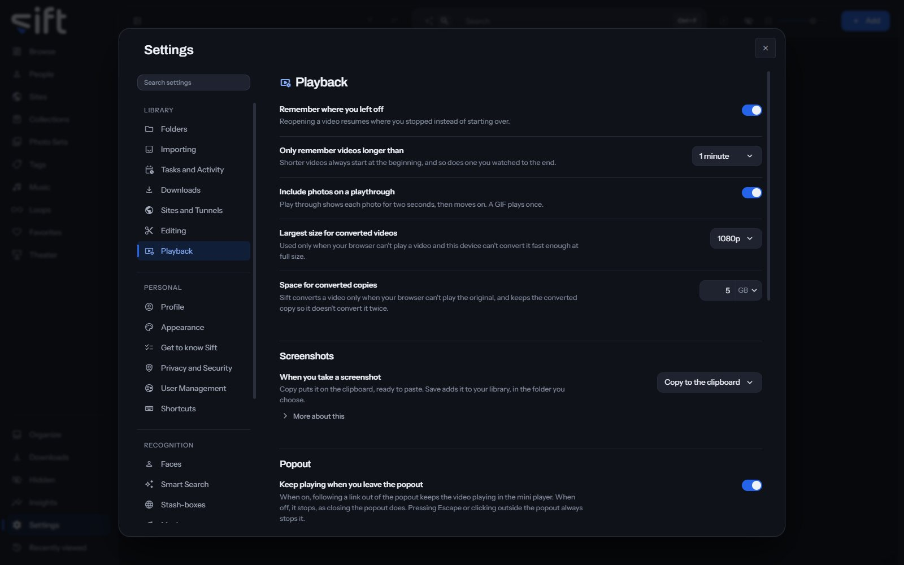

<!-- GENERATED by scripts/docs_generate.py from the settings registry and the client's sections.ts. Edit the source, never this page. -->

Playback is where you choose how videos and photos play, in the player, the popout and Theater. To open it, go to [Settings > Playback](/settings/playback).

Come here to make Sift remember where you left off, choose what a screenshot does, or set how Theater opens.

## On this pane

The first rows have no heading: resuming, photos on a playthrough, and converted copies. Then the pane draws these groups, in this order:

- **Screenshots**: what happens when you take a screenshot of a video, and where a saved one goes.
- **Popout**: whether a video keeps playing in the Mini player when you leave the popout.
- **Remote**: whether a phone signed in as you can control this browser.
- **Theater**: the layout Theater opens with, center stage, autoplay and how long each cell plays.

## Every setting

### Remember where you left off

Reopening a video resumes where you stopped instead of starting over.

- **Path**: [Settings > Playback > Remember where you left off](/settings/playback#playback.resume_enabled)
- **Default**: On
- **Who sets it**: each User, for themselves

### Only remember videos longer than

Shorter videos always start at the beginning, and so does one you watched to the end.

- **Path**: [Settings > Playback > Only remember videos longer than](/settings/playback#playback.resume_minimum_seconds)
- **Default**: 1 minute
- **Choices**: Every video, 30 seconds, 1 minute, 3 minutes, 5 minutes, 10 minutes, 30 minutes
- **Who sets it**: each User, for themselves

### Include photos on a playthrough

Play through shows each photo for two seconds, then moves on. A GIF plays once.

- **Path**: [Settings > Playback > Include photos on a playthrough](/settings/playback#playback.dwell_pictures)
- **Default**: On
- **Who sets it**: each User, for themselves

### When you take a screenshot

Copy puts it on the clipboard, ready to paste. Save adds it to your library, in the folder you choose.

Over a plain http address the browser has no clipboard for pictures, so there the screenshot is downloaded instead.

- **Path**: [Settings > Playback > When you take a screenshot](/settings/playback#playback.screenshot)
- **Default**: Copy to the clipboard
- **Choices**: Copy to the clipboard, Save to a folder
- **Who sets it**: each User, for themselves

### Save screenshots to

A folder in your library. Unless you choose one, screenshots go to your download folder.

- **Path**: [Settings > Playback > Save screenshots to](/settings/playback#playback.screenshot_folder)
- **Default**: empty
- **Who sets it**: each User, for themselves

### Largest size for converted videos

Used only when your browser can't play a video and this device can't convert it fast enough at full size.

- **Path**: [Settings > Playback > Largest size for converted videos](/settings/playback#playback.max_transcode_height)
- **Default**: 1080p
- **Choices**: 360p, 480p, 720p, 1080p, 1440p, 4K
- **Who sets it**: an admin, for everyone on this Sift

### Space for converted copies

Sift converts a video only when your browser can't play the original, and keeps the converted copy so it doesn't convert it twice.

- **Path**: [Settings > Playback > Space for converted copies](/settings/playback#playback.cache_max_gb)
- **Default**: 5 GB
- **Range**: 1 to 512 GB
- **Who sets it**: an admin, for everyone on this Sift

### Default layout when Theater opens

You can choose another from the wall itself.

- **Path**: [Settings > Playback > Default layout when Theater opens](/settings/playback#theater.layout)
- **Default**: 1x3
- **Choices**: 1x1, 1x2, 1x3, 2x2, Center stage 1x1, Center stage 1x2, Center stage 1x3, Center stage 2x2
- **Who sets it**: each User, for themselves

### When a preview comes up

Center stage shows up to four videos in focus with previews under them. Selecting a preview always brings it into focus.

Something new means the next file in that preview's queue. Resuming after a pause, a seek or a stall isn't a new file, so it doesn't bring a preview into focus.

- **Path**: [Settings > Playback > When a preview comes up](/settings/playback#theater.center_stage)
- **Default**: When I press it
- **Choices**: When I press it, As soon as it starts something new
- **Who sets it**: each User, for themselves

### Start playing when Theater opens

Every cell starts as soon as Theater opens.

- **Path**: [Settings > Playback > Start playing when Theater opens](/settings/playback#theater.autoplay)
- **Default**: Off
- **Who sets it**: each User, for themselves

### Play the next file after

How long a cell shows one file before it plays the next, finished or not.

Leave it empty to wait for each file to end.

- **Path**: [Settings > Playback > Play the next file after](/settings/playback#theater.timer_seconds)
- **Default**: No timer
- **Range**: No timer to 3600 sec
- **Who sets it**: each User, for themselves

### Pick up where you left off

Coming back to Theater brings back the layout and what each cell was playing. It's remembered until Sift restarts or the page is reloaded.

- **Path**: [Settings > Playback > Pick up where you left off](/settings/playback#theater.resume)
- **Default**: Off
- **Who sets it**: each User, for themselves
