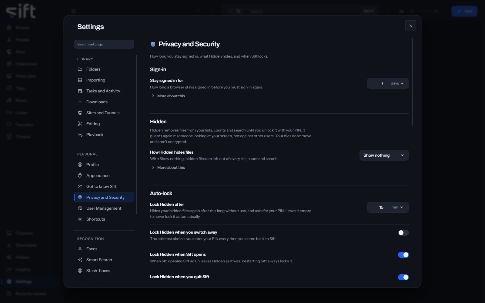

<!-- GENERATED by scripts/docs_generate.py from the settings registry and the client's sections.ts. Edit the source, never this page. -->

Privacy and Security is where you choose how long you stay signed in, what Hidden hides, and when Sift locks. To open it, go to [Settings > Privacy and Security](/settings/privacy).

Come here to set when Hidden locks, to clear your history, or to choose whether guests can save files. An admin also sees the settings that apply to every User.

## On this pane

The pane draws these groups, in this order:

- **Sign-in**: how long a browser stays signed in.
- **Hidden**: how Hidden hides your hidden files.
- **Auto-lock**: when Hidden locks again by itself.
- **Sift lock**: whether your PIN unlocks a locked Sift on your local network, and when all of Sift locks.
- **Your history**: whether Sift notes what you watch, open and search for.
- **Save to device**: whether guests can save a copy of a file to their own device.
- **File locations**: whether your profile folder's name is blurred in a file's location.
- **Search history**: how long Sift keeps the searches you run.

## Rows the pane draws by hand

- **Clear your history**: **Clear** deletes what you've watched, opened and searched for. Your files, ratings, tags and saved searches stay.
- **Copies saved to a device**: **Open** lists every copy saved to a device, in App History.

## Every setting

### Keep your history

Sift notes what you watch, open and search for, so Insights can show how you use your library. It stays on the device Sift runs on and only you can see it.

Turn it off to pause: nothing new is noted until you turn it on again.

- **Path**: [Settings > Privacy and Security > Keep your history](/settings/privacy#history.keep)
- **Default**: On
- **Who sets it**: each User, for themselves

### Guests can save files

Guests can always watch what you share with them. When this is on, they can also save a copy to their own device.

This isn't a lock. A file a guest plays is sent to them whole, so share only what you're comfortable with a guest keeping.

- **Path**: [Settings > Privacy and Security > Guests can save files](/settings/privacy#guests.can_save_to_device)
- **Default**: Off
- **Who sets it**: an admin, for everyone on this Sift

### Hide my profile folder in paths

Where Sift shows a file's full location, the name of your profile folder is blurred. Your Windows sign-in name is often that folder's name.

Only paths inside your profile folder on this device change, since that's the only place the name appears. A file on another drive or on a network share, such as a NAS, is shown with its path as it is.

- **Path**: [Settings > Privacy and Security > Hide my profile folder in paths](/settings/privacy#paths.hide_account_name)
- **Default**: Off
- **Who sets it**: each User, for themselves

### Keep search history for

Sift saves each search you run, so it can show how you use your library. Set a number of days to delete older searches.

Only you can see your search history, and Sift's log never records a search. Leave it empty to keep it until you clear it yourself.

- **Path**: [Settings > Privacy and Security > Keep search history for](/settings/privacy#search.keep_records_days)
- **Default**: Forever
- **Range**: Forever to 3650 days
- **Who sets it**: an admin, for everyone on this Sift

### Delete old search history

Deletes searches from your search history once they are older than the limit set in Privacy.

- **Path**: [Settings > Privacy and Security > Delete old search history](/settings/privacy#privacy.search_history)
- **Default**: During quiet hours
- **Choices**: On a schedule, During quiet hours, Only when I press it
- **Who sets it**: an admin, for everyone on this Sift

### Stay signed in for

How long a browser stays signed in before you must sign in again.

Applies from your next sign-in. A browser already signed in isn't signed out early.

- **Path**: [Settings > Privacy and Security > Stay signed in for](/settings/privacy#sessions.stay_signed_in_days)
- **Default**: 7 days
- **Range**: 1 to 365 days
- **Who sets it**: an admin, for everyone on this Sift

### How Hidden hides files

With Show nothing, hidden files are left out of every list, count and search.

With Show a locked tile, you can see that something is there but not what it is. Either way, Sift never sends a hidden file until you unlock Hidden.

- **Path**: [Settings > Privacy and Security > How Hidden hides files](/settings/privacy#vault.concealment)
- **Default**: Show nothing
- **Choices**: Show nothing, Show a locked tile
- **Who sets it**: each User, for themselves

### Lock Hidden after

Hides your hidden files again after this long without use, and asks for your PIN. Leave it empty to never lock it automatically.

- **Path**: [Settings > Privacy and Security > Lock Hidden after](/settings/privacy#vault.lock_after_idle_minutes)
- **Default**: 15 min
- **Range**: Never to 1440 min
- **Who sets it**: each User, for themselves

### Lock Hidden when you switch away

The strictest choice: you enter your PIN every time you come back to Sift.

- **Path**: [Settings > Privacy and Security > Lock Hidden when you switch away](/settings/privacy#vault.lock_on_blur)
- **Default**: Off
- **Who sets it**: each User, for themselves

### Lock Hidden when Sift opens

When off, opening Sift again leaves Hidden as it was. Restarting Sift always locks it.

- **Path**: [Settings > Privacy and Security > Lock Hidden when Sift opens](/settings/privacy#vault.lock_on_launch)
- **Default**: On
- **Who sets it**: each User, for themselves

### Lock Hidden when you quit Sift

The next person to open Sift on this device finds Hidden locked.

- **Path**: [Settings > Privacy and Security > Lock Hidden when you quit Sift](/settings/privacy#vault.lock_on_close)
- **Default**: On
- **Who sets it**: each User, for themselves

### Unlock Sift with your PIN on LAN

When on, your PIN unlocks a locked Sift on your local network. Anywhere else, and when this is off, your password does.

Locking Sift keeps you signed in either way, and you can still sign out at any time. Through a tunnel or from outside your network, Sift always asks for your password.

- **Path**: [Settings > Privacy and Security > Unlock Sift with your PIN on LAN](/settings/privacy#vault.app_lock_enabled)
- **Default**: Off
- **Who sets it**: each User, for themselves

### Lock Sift after

Locks all of Sift after this long without use. Lock Hidden after only hides your hidden files.

Leave it empty to never lock Sift automatically.

- **Path**: [Settings > Privacy and Security > Lock Sift after](/settings/privacy#vault.app_lock_after_idle_minutes)
- **Default**: Never
- **Range**: Never to 1440 min
- **Who sets it**: each User, for themselves
