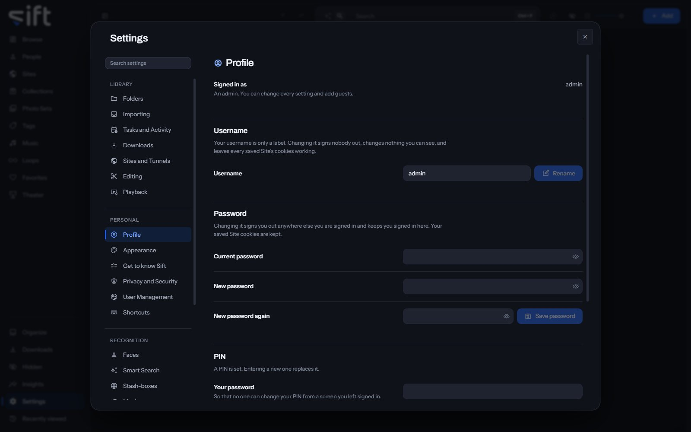

<!-- GENERATED by scripts/docs_generate.py from the settings registry and the client's sections.ts. Edit the source, never this page. -->

Profile is where you change your own username, password and PIN, and sign out. To open it, go to [Settings > Profile](/settings/profile).

Come here to change your password or set the PIN that unlocks Hidden. Every User has a Profile, guests included.

## On this pane

Nothing on this pane is a stored setting. It draws these groups, in this order:

- **Signed in as**: your username, and whether you're an admin or a guest.
- **Username**: your username is only a label. **Rename** changes it, and nobody is signed out.
- **Password**: enter your current password and the new one twice, then choose **Save password**. You stay signed in here and are signed out everywhere else.
- **PIN**: six digits that unlock Hidden, and a locked Sift. Enter your password and the new PIN, then choose **Save PIN**.
- **Sign out**: **Sign out** signs this browser out. Anywhere else you're signed in isn't affected.

Nothing on this pane is a stored setting: everything on it acts when you press it.
