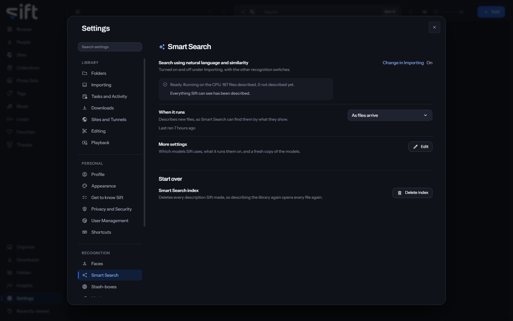

<!-- GENERATED by scripts/docs_generate.py from the settings registry and the client's sections.ts. Edit the source, never this page. -->

Smart Search lets you search your library in your own words, and for files that look like another. To open its settings, go to [Settings > Smart Search](/settings/semantic).

Come here to see how many files Sift has described, or to choose the models and what they run on. Sift describes your files with SigLIP 2, on your computer.

## On this pane

The first rows have no heading: the switch, how many files are described, when it runs, and **More settings**. The switch is turned on and off in [Settings > Tasks and Activity > Import tasks > Identify settings](/settings/tasks#importing.recognition). Then the pane draws one group:

- **Start over**: delete every description Sift made.

## Rows the pane draws by hand

- **More settings**: **Edit** opens which models Sift uses, what it runs them on, and a fresh copy of the models. A download that can't connect shows why and what to check. It uses the proxy set in Windows, or in `HTTPS_PROXY`. A proxy set by an automatic configuration script isn't read.
- **Smart Search index**: **Delete index** deletes every description Sift made, so describing the library again opens every file again.

## Every setting

### Search using natural language and similarity

Search your library by describing what you want, and see files that look alike. A small AI model runs on this device.

Sift ships no search models. When you choose Download the models, Sift downloads the default set, SigLIP 2 (base, patch16-224), from the onnx-community repository on Hugging Face. The download is about 382 MB.

- **Path**: [Settings > Smart Search > Search using natural language and similarity](/settings/semantic#semantic.enabled)
- **Default**: Off
- **Who sets it**: an admin, for everyone on this Sift

### Description models

Compact is quicker and smaller. Full is more precise on a large library of similar-looking files.

Compact is a 380 MB download and describes a picture in about a tenth of a second. Full is 1.5 GB and about half again as slow. Both found the right answer in every test; Full ranks it further ahead, which matters on a large library. Changing models describes every file again, because the two models' results can't be compared.

- **Path**: [Settings > Smart Search > Description models](/settings/semantic#semantic.model)
- **Default**: Compact
- **Choices**: Compact, Full
- **Who sets it**: an admin, for everyone on this Sift

### Run descriptions on

Sift uses the CPU unless you choose a GPU. You can't choose a GPU Sift can't reach.

Sift ships the CPU-only build of its model runtime, so the GPU can't be used until the GPU's own runtime is added. Sift can download it under GPU in [Settings > Performance](/settings/performance). It's about 1.3 GB, downloaded once and stored next to your libraries, so an update doesn't remove it and a new library needs nothing. It needs an NVIDIA GPU and a current driver, and nothing else installed by hand.

- **Path**: [Settings > Smart Search > Run descriptions on](/settings/semantic#semantic.device)
- **Default**: CPU
- **Choices**: CPU, GPU
- **Who sets it**: an admin, for everyone on this Sift
