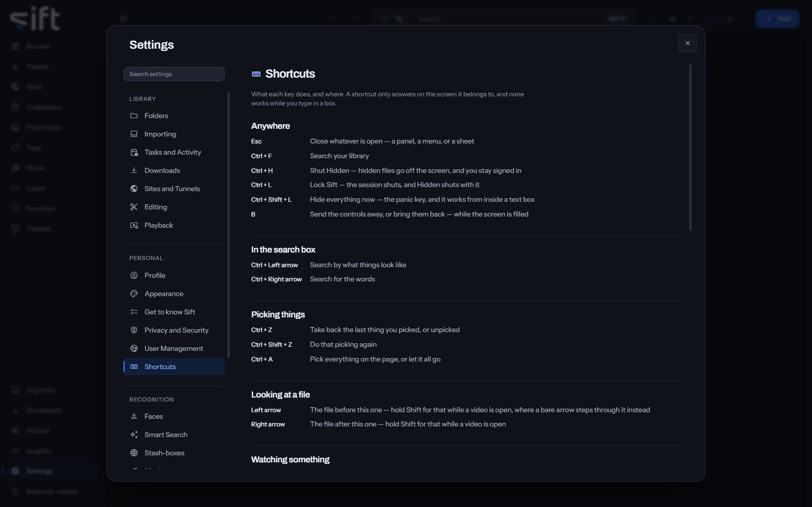

<!-- GENERATED by scripts/docs_generate.py from the settings registry and the client's sections.ts. Edit the source, never this page. -->

Shortcuts is the list of what each key does in Sift, and where. To open it, go to [Settings > Shortcuts](/settings/shortcuts).

Come here to look up a key. A shortcut works only on the screen it belongs to, and none works while you type in a box.

## On this pane

Nothing on this pane can be changed. It lists the keys in these groups:

- **Anywhere**: closing what is open, searching, locking Hidden and Sift, and the panic key.
- **In the search box**: switching between searching by what things look like and by words.
- **Picking things**: picking everything, and taking back or doing again the last pick.
- **Looking at a file**: the file before and after this one.
- **Watching something**: play, pause, step, volume, the Mini player, repeat, shuffle, Loops and full screen.
- **Theater**: controlling one cell or every cell, and their volume.

Nothing on this pane is a stored setting: everything on it acts when you press it.
