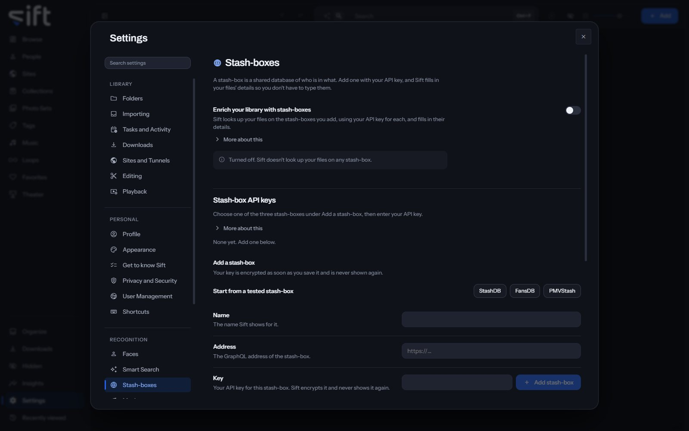

<!-- GENERATED by scripts/docs_generate.py from the settings registry and the client's sections.ts. Edit the source, never this page. -->

A stash-box is a shared database of who is in what, and Sift fills in your files' details from the ones you add. To open its settings, go to [Settings > Stash-boxes](/settings/stash-boxes).

Come here to add a stash-box with your API key and choose what Sift does with the details it finds. Sift offers three tested stash-boxes: StashDB, FansDB and PMVStash.

## On this pane

The first row has no heading: the switch that turns enrichment on. Then the pane draws these groups, in this order:

- **Stash-box API keys**: the stash-boxes you added. **Add a stash-box** takes a **Name**, an **Address** and your **Key**, or **Start from a tested stash-box** fills in the first two. Then choose **Add stash-box**.
- **Stash-box search**: **Search by name** searches every stash-box that's turned on. Nothing is saved to your library.
- **Stash-box fields**: what Sift does when a stash-box has a value for a field. **For every field** sets one answer, and **Choose for each field** opens every field with **Edit**.

Your key is encrypted as soon as you save it, and Sift never shows it again.

## Every setting

### Enrich your library with stash-boxes

Sift looks up your files on the stash-boxes you add, using your API key for each, and fills in their details.

A stash-box is a shared database of details about adult videos and the people in them. Sift sends each file's fingerprint and adds the details of any match to your library. Your files are never sent.

- **Path**: [Settings > Stash-boxes > Enrich your library with stash-boxes](/settings/stash-boxes#stash_boxes.scan)
- **Default**: Off
- **Who sets it**: an admin, for everyone on this Sift

### Confirm exact matches automatically

When an automatic lookup finds an exact match, Sift adds the details right away. Other matches wait in Organize.

Running Auto-enrich yourself always confirms exact matches, because you asked for it. This decides only for lookups Sift starts by itself, such as for new files. Other matches wait in Organize either way.

- **Path**: [Settings > Stash-boxes > Confirm exact matches automatically](/settings/stash-boxes#stash_boxes.apply_certain)
- **Default**: On
- **Who sets it**: an admin, for everyone on this Sift

### Auto-enrich using

The stash-box Sift's automatic lookups use, and the one Auto-enrich uses when you don't choose one.

Every stash-box you add stays on, and you can still search any of them yourself.

- **Path**: [Settings > Stash-boxes > Auto-enrich using](/settings/stash-boxes#stash_boxes.auto_box)
- **Default**: All stash-boxes
- **Choices**: All stash-boxes, FansDB, PMVStash, StashDB
- **Who sets it**: an admin, for everyone on this Sift

### Allow lengths to differ by

Two copies of the same video run for about the same time.

Sift ignores a match whose length differs by more than this, so a different cut of the same video isn't taken for yours.

- **Path**: [Settings > Stash-boxes > Allow lengths to differ by](/settings/stash-boxes#stash_boxes.duration_tolerance_s)
- **Default**: 10 sec
- **Range**: 0 to 600 sec
- **Who sets it**: an admin, for everyone on this Sift

### Create new people

When off, people a stash-box names that your library doesn't have are skipped.

Applies only to automatic lookups and to Auto-enrich. What you confirm yourself always creates what you select.

- **Path**: [Settings > Stash-boxes > Create new people](/settings/stash-boxes#stash_boxes.invent.person)
- **Default**: On
- **Who sets it**: an admin, for everyone on this Sift

### Create new Sites

When off, Sites a stash-box names that your library doesn't have are skipped.

Applies only to automatic lookups and to Auto-enrich. What you confirm yourself always creates what you select.

- **Path**: [Settings > Stash-boxes > Create new Sites](/settings/stash-boxes#stash_boxes.invent.site)
- **Default**: On
- **Who sets it**: an admin, for everyone on this Sift

### Create new tags

When off, tags a stash-box names that your library doesn't have are skipped.

Applies only to automatic lookups and to Auto-enrich. What you confirm yourself always creates what you select.

- **Path**: [Settings > Stash-boxes > Create new tags](/settings/stash-boxes#stash_boxes.invent.tag)
- **Default**: On
- **Who sets it**: an admin, for everyone on this Sift

### Name

What Sift does when a stash-box has this for a person.

- **Path**: [Settings > Stash-boxes > Name](/settings/stash-boxes#enrich.person.name)
- **Default**: Fill in what is missing
- **Choices**: Leave alone, Fill in what is missing, Replace what is there
- **Who sets it**: an admin, for everyone on this Sift

### Aliases

What Sift does when a stash-box has this for a person.

- **Path**: [Settings > Stash-boxes > Aliases](/settings/stash-boxes#enrich.person.aliases)
- **Default**: Fill in what is missing
- **Choices**: Leave alone, Fill in what is missing, Replace what is there
- **Who sets it**: an admin, for everyone on this Sift

### Details

What Sift does when a stash-box has this for a person.

- **Path**: [Settings > Stash-boxes > Details](/settings/stash-boxes#enrich.person.details)
- **Default**: Fill in what is missing
- **Choices**: Leave alone, Fill in what is missing, Replace what is there
- **Who sets it**: an admin, for everyone on this Sift

### Links

What Sift does when a stash-box has this for a person.

- **Path**: [Settings > Stash-boxes > Links](/settings/stash-boxes#enrich.person.links)
- **Default**: Fill in what is missing
- **Choices**: Leave alone, Fill in what is missing, Replace what is there
- **Who sets it**: an admin, for everyone on this Sift

### Usernames

What Sift does when a stash-box has this for a person.

- **Path**: [Settings > Stash-boxes > Usernames](/settings/stash-boxes#enrich.person.accounts)
- **Default**: Fill in what is missing
- **Choices**: Leave alone, Fill in what is missing, Replace what is there
- **Who sets it**: an admin, for everyone on this Sift

### Tags

What Sift does when a stash-box has this for a person.

- **Path**: [Settings > Stash-boxes > Tags](/settings/stash-boxes#enrich.person.tags)
- **Default**: Fill in what is missing
- **Choices**: Leave alone, Fill in what is missing, Replace what is there
- **Who sets it**: an admin, for everyone on this Sift

### Birthdate

What Sift does when a stash-box has this for a person.

- **Path**: [Settings > Stash-boxes > Birthdate](/settings/stash-boxes#enrich.person.birth_date)
- **Default**: Fill in what is missing
- **Choices**: Leave alone, Fill in what is missing, Replace what is there
- **Who sets it**: an admin, for everyone on this Sift

### Nationality

What Sift does when a stash-box has this for a person.

- **Path**: [Settings > Stash-boxes > Nationality](/settings/stash-boxes#enrich.person.country)
- **Default**: Fill in what is missing
- **Choices**: Leave alone, Fill in what is missing, Replace what is there
- **Who sets it**: an admin, for everyone on this Sift

### Hair color

What Sift does when a stash-box has this for a person.

- **Path**: [Settings > Stash-boxes > Hair color](/settings/stash-boxes#enrich.person.hair_color)
- **Default**: Fill in what is missing
- **Choices**: Leave alone, Fill in what is missing, Replace what is there
- **Who sets it**: an admin, for everyone on this Sift

### Measurements

What Sift does when a stash-box has this for a person.

- **Path**: [Settings > Stash-boxes > Measurements](/settings/stash-boxes#enrich.person.measurements)
- **Default**: Fill in what is missing
- **Choices**: Leave alone, Fill in what is missing, Replace what is there
- **Who sets it**: an admin, for everyone on this Sift

### Disambiguation

What Sift does when a stash-box has this for a person.

- **Path**: [Settings > Stash-boxes > Disambiguation](/settings/stash-boxes#enrich.person.disambiguation)
- **Default**: Fill in what is missing
- **Choices**: Leave alone, Fill in what is missing, Replace what is there
- **Who sets it**: an admin, for everyone on this Sift

### Gender

What Sift does when a stash-box has this for a person.

- **Path**: [Settings > Stash-boxes > Gender](/settings/stash-boxes#enrich.person.gender)
- **Default**: Fill in what is missing
- **Choices**: Leave alone, Fill in what is missing, Replace what is there
- **Who sets it**: an admin, for everyone on this Sift

### Ethnicity

What Sift does when a stash-box has this for a person.

- **Path**: [Settings > Stash-boxes > Ethnicity](/settings/stash-boxes#enrich.person.ethnicity)
- **Default**: Fill in what is missing
- **Choices**: Leave alone, Fill in what is missing, Replace what is there
- **Who sets it**: an admin, for everyone on this Sift

### Eye color

What Sift does when a stash-box has this for a person.

- **Path**: [Settings > Stash-boxes > Eye color](/settings/stash-boxes#enrich.person.eye_color)
- **Default**: Fill in what is missing
- **Choices**: Leave alone, Fill in what is missing, Replace what is there
- **Who sets it**: an admin, for everyone on this Sift

### Height

What Sift does when a stash-box has this for a person.

- **Path**: [Settings > Stash-boxes > Height](/settings/stash-boxes#enrich.person.height_cm)
- **Default**: Fill in what is missing
- **Choices**: Leave alone, Fill in what is missing, Replace what is there
- **Who sets it**: an admin, for everyone on this Sift

### Breast type

What Sift does when a stash-box has this for a person.

- **Path**: [Settings > Stash-boxes > Breast type](/settings/stash-boxes#enrich.person.breast_type)
- **Default**: Fill in what is missing
- **Choices**: Leave alone, Fill in what is missing, Replace what is there
- **Who sets it**: an admin, for everyone on this Sift

### Career start

What Sift does when a stash-box has this for a person.

- **Path**: [Settings > Stash-boxes > Career start](/settings/stash-boxes#enrich.person.career_start_year)
- **Default**: Fill in what is missing
- **Choices**: Leave alone, Fill in what is missing, Replace what is there
- **Who sets it**: an admin, for everyone on this Sift

### Career end

What Sift does when a stash-box has this for a person.

- **Path**: [Settings > Stash-boxes > Career end](/settings/stash-boxes#enrich.person.career_end_year)
- **Default**: Fill in what is missing
- **Choices**: Leave alone, Fill in what is missing, Replace what is there
- **Who sets it**: an admin, for everyone on this Sift

### Tattoos

What Sift does when a stash-box has this for a person.

- **Path**: [Settings > Stash-boxes > Tattoos](/settings/stash-boxes#enrich.person.tattoos)
- **Default**: Fill in what is missing
- **Choices**: Leave alone, Fill in what is missing, Replace what is there
- **Who sets it**: an admin, for everyone on this Sift

### Piercings

What Sift does when a stash-box has this for a person.

- **Path**: [Settings > Stash-boxes > Piercings](/settings/stash-boxes#enrich.person.piercings)
- **Default**: Fill in what is missing
- **Choices**: Leave alone, Fill in what is missing, Replace what is there
- **Who sets it**: an admin, for everyone on this Sift

### Name

What Sift does when a stash-box has this for a Site.

- **Path**: [Settings > Stash-boxes > Name](/settings/stash-boxes#enrich.site.name)
- **Default**: Fill in what is missing
- **Choices**: Leave alone, Fill in what is missing, Replace what is there
- **Who sets it**: an admin, for everyone on this Sift

### Links

What Sift does when a stash-box has this for a Site.

- **Path**: [Settings > Stash-boxes > Links](/settings/stash-boxes#enrich.site.links)
- **Default**: Fill in what is missing
- **Choices**: Leave alone, Fill in what is missing, Replace what is there
- **Who sets it**: an admin, for everyone on this Sift

### Details

What Sift does when a stash-box has this for a Site.

- **Path**: [Settings > Stash-boxes > Details](/settings/stash-boxes#enrich.site.details)
- **Default**: Fill in what is missing
- **Choices**: Leave alone, Fill in what is missing, Replace what is there
- **Who sets it**: an admin, for everyone on this Sift

### Tags

What Sift does when a stash-box has this for a Site.

- **Path**: [Settings > Stash-boxes > Tags](/settings/stash-boxes#enrich.site.tags)
- **Default**: Fill in what is missing
- **Choices**: Leave alone, Fill in what is missing, Replace what is there
- **Who sets it**: an admin, for everyone on this Sift

### Aliases

What Sift does when a stash-box has this for a Site.

- **Path**: [Settings > Stash-boxes > Aliases](/settings/stash-boxes#enrich.site.aliases)
- **Default**: Fill in what is missing
- **Choices**: Leave alone, Fill in what is missing, Replace what is there
- **Who sets it**: an admin, for everyone on this Sift

### Part of

What Sift does when a stash-box has this for a Site.

- **Path**: [Settings > Stash-boxes > Part of](/settings/stash-boxes#enrich.site.parent)
- **Default**: Fill in what is missing
- **Choices**: Leave alone, Fill in what is missing, Replace what is there
- **Who sets it**: an admin, for everyone on this Sift

### Aliases

What Sift does when a stash-box has this for a tag.

- **Path**: [Settings > Stash-boxes > Aliases](/settings/stash-boxes#enrich.tag.aliases)
- **Default**: Fill in what is missing
- **Choices**: Leave alone, Fill in what is missing, Replace what is there
- **Who sets it**: an admin, for everyone on this Sift

### Category

What Sift does when a stash-box has this for a tag.

- **Path**: [Settings > Stash-boxes > Category](/settings/stash-boxes#enrich.tag.category)
- **Default**: Fill in what is missing
- **Choices**: Leave alone, Fill in what is missing, Replace what is there
- **Who sets it**: an admin, for everyone on this Sift

### Description

What Sift does when a stash-box has this for a tag.

- **Path**: [Settings > Stash-boxes > Description](/settings/stash-boxes#enrich.tag.description)
- **Default**: Fill in what is missing
- **Choices**: Leave alone, Fill in what is missing, Replace what is there
- **Who sets it**: an admin, for everyone on this Sift

### Title

What Sift does when a stash-box has this for a file.

- **Path**: [Settings > Stash-boxes > Title](/settings/stash-boxes#enrich.asset.title)
- **Default**: Fill in what is missing
- **Choices**: Leave alone, Fill in what is missing, Replace what is there
- **Who sets it**: an admin, for everyone on this Sift

### Released

What Sift does when a stash-box has this for a file.

- **Path**: [Settings > Stash-boxes > Released](/settings/stash-boxes#enrich.asset.release_date)
- **Default**: Fill in what is missing
- **Choices**: Leave alone, Fill in what is missing, Replace what is there
- **Who sets it**: an admin, for everyone on this Sift

### Details

What Sift does when a stash-box has this for a file.

- **Path**: [Settings > Stash-boxes > Details](/settings/stash-boxes#enrich.asset.details)
- **Default**: Fill in what is missing
- **Choices**: Leave alone, Fill in what is missing, Replace what is there
- **Who sets it**: an admin, for everyone on this Sift

### Links

What Sift does when a stash-box has this for a file.

- **Path**: [Settings > Stash-boxes > Links](/settings/stash-boxes#enrich.asset.links)
- **Default**: Fill in what is missing
- **Choices**: Leave alone, Fill in what is missing, Replace what is there
- **Who sets it**: an admin, for everyone on this Sift

### Shot on

What Sift does when a stash-box has this for a file.

- **Path**: [Settings > Stash-boxes > Shot on](/settings/stash-boxes#enrich.asset.production_date)
- **Default**: Fill in what is missing
- **Choices**: Leave alone, Fill in what is missing, Replace what is there
- **Who sets it**: an admin, for everyone on this Sift

### Site code

What Sift does when a stash-box has this for a file.

- **Path**: [Settings > Stash-boxes > Site code](/settings/stash-boxes#enrich.asset.site_code)
- **Default**: Fill in what is missing
- **Choices**: Leave alone, Fill in what is missing, Replace what is there
- **Who sets it**: an admin, for everyone on this Sift

### Music

What Sift does when a stash-box has this for a file.

- **Path**: [Settings > Stash-boxes > Music](/settings/stash-boxes#enrich.asset.music)
- **Default**: Fill in what is missing
- **Choices**: Leave alone, Fill in what is missing, Replace what is there
- **Who sets it**: an admin, for everyone on this Sift

### Who is in this

What Sift does when a stash-box has this for a file.

- **Path**: [Settings > Stash-boxes > Who is in this](/settings/stash-boxes#enrich.asset.people)
- **Default**: Fill in what is missing
- **Choices**: Leave alone, Fill in what is missing, Replace what is there
- **Who sets it**: an admin, for everyone on this Sift

### Tags

What Sift does when a stash-box has this for a file.

- **Path**: [Settings > Stash-boxes > Tags](/settings/stash-boxes#enrich.asset.tags)
- **Default**: Fill in what is missing
- **Choices**: Leave alone, Fill in what is missing, Replace what is there
- **Who sets it**: an admin, for everyone on this Sift

### Site

What Sift does when a stash-box has this for a file.

- **Path**: [Settings > Stash-boxes > Site](/settings/stash-boxes#enrich.asset.site)
- **Default**: Fill in what is missing
- **Choices**: Leave alone, Fill in what is missing, Replace what is there
- **Who sets it**: an admin, for everyone on this Sift

### Usernames

What Sift does when a stash-box has this for a file.

- **Path**: [Settings > Stash-boxes > Usernames](/settings/stash-boxes#enrich.asset.accounts)
- **Default**: Fill in what is missing
- **Choices**: Leave alone, Fill in what is missing, Replace what is there
- **Who sets it**: an admin, for everyone on this Sift

### Who made it

What Sift does when a stash-box has this for a file.

- **Path**: [Settings > Stash-boxes > Who made it](/settings/stash-boxes#enrich.asset.creator)
- **Default**: Fill in what is missing
- **Choices**: Leave alone, Fill in what is missing, Replace what is there
- **Who sets it**: an admin, for everyone on this Sift
