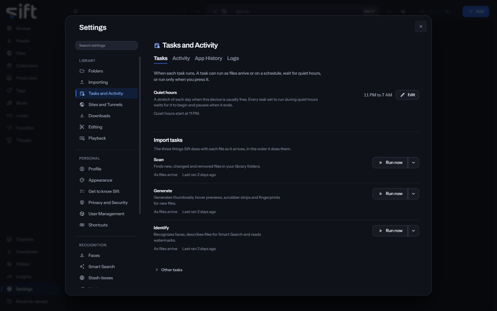

<!-- GENERATED by scripts/docs_generate.py from the settings registry and the client's sections.ts. Edit the source, never this page. -->

Tasks and Activity is where you choose when each task runs and see what Sift has done. To open it, go to [Settings > Tasks and Activity](/settings/tasks).

Come here to run a task now, change when it runs, choose what each import stage makes, or find out what happened to a file. The pane has three tabs.

## The tabs

- **Tasks**: every task, its **Edit** and its **Run now** press and its When. A When is **As files arrive**, **On a schedule**, **During quiet hours** or **Only when I press it**, as each task offers. Under the tasks, **Activity**: what is running and what ran, with each task's status, time left and progress, and the **Task Queue**. While a scan is still counting folders, the Scan row and every task after it show **Not known until every folder is counted.** A task that waits for a scan to read its files says **Waiting for the scan to finish.** When a network share holds the reading back, the Scan row names the library folders on that share. **Run now** on a bar opens that task's row.
- **App History**: everything Sift and you have done in your library, newest first. Select a name to open what it happened to.
- **Logs**: a record of what Sift did. Read it first when something goes wrong.

## On the Tasks tab

- **Quiet hours**: a stretch of each day when your computer is usually free. A task set to run during quiet hours waits for it to begin and pauses when it ends. **Edit** changes the hours.
- **Import tasks**: Scan, Generate and Identify, the three things Sift does with each file as it arrives, in the order Sift runs them. Each row says when it runs and what is still waiting for it; **Edit** opens the stage's own settings.
- **Scan**: finds new, changed and removed files in your library folders.
- **Generate**: creates thumbnails, hover previews, scrubber strips and fingerprints for new files.
- **Identify**: recognizes faces, describes files for Smart Search and reads watermarks. Its settings hold the three recognition switches.
- **Folder-specific import settings**: gives one library folder its own settings, or lets it follow the default. **Edit** beside a folder opens them.
- **Other tasks**: work Sift does for the library as a whole, such as finding duplicates and creating backups.
- **Activity**: what is running and what ran, under **Library tasks** and **Other tasks**. Under it the **Task Queue**, twenty a page, with **Options** and **Type** to show one type of task.
- **Other settings**: settings filed with the tasks that belong to no task above.

## On the App History tab

- **Show**: **Everything**, or only the **Decisions**, each with its **Undo**.
- **Type**: shows only one type of thing.
- **Action**: shows only one action.
- **Undo** and **Undo all**: take back a decision, or every decision one press made, while they still can.
- **Report**: opens a task's report: how many files it read, how long it took and on which device. **Copy report** copies it.
- **Decisions**: App History showing only what was decided on Organize and what Sift filed by itself.
- **Saved to a device**: App History showing only the copies someone saved to their own device.
- **How long tasks take**: every task that ran over your library, from App History.

## Reading and saving the log

- **Show**, on the **Logs** tab: the least serious line to show: **Critical**, **Error**, **Warning**, **Info** or **Debug**. Each choice also shows everything more serious than it.
- **Filter the log**: shows only the lines holding the words you type.
- **Refresh**: reads the newest lines.
- **Copy for a bug report**: copies the lines on screen as they are, without redaction. Read the lines before you paste anywhere public.
- **Download log**: saves every log whole as one zip file, whatever the screen is filtered to, without your personal details and secrets. In the Sift app the file holds the library's log and the app's own. In a browser it holds the library's. The line under it, **Download redacted log**, says so. Attach this file to a bug report.

## Tasks

### Automatic backup

Saves your library's records into a folder, and keeps the last few.

- **Path**: [Settings > Tasks and Activity > Automatic backup](/settings/tasks#tasks.backup.when)
- **When it runs**: Only when I press it
- **Choices**: On a schedule, During quiet hours, Only when I press it
- **Its settings**: How often, Time of day
- **More in**: [Settings > Backup and restore](/settings/backup)
- **Who sets it**: an admin, for everyone on this Sift

### Generate

Generates thumbnails, hover previews, scrubber strips and fingerprints for new files.

- **Path**: [Settings > Tasks and Activity > Generate](/settings/tasks#tasks.generate.when)
- **When it runs**: As files arrive
- **Choices**: As files arrive, During quiet hours, Only when I press it
- **Who sets it**: an admin, for everyone on this Sift

### Identify

Recognizes faces, describes files for Smart Search and reads watermarks.

- **Path**: [Settings > Tasks and Activity > Identify](/settings/tasks#tasks.identify.when)
- **Who sets it**: an admin, for everyone on this Sift

### Describe files for Smart Search

Describes new files, so Smart Search can find them by what they show.

- **Path**: [Settings > Tasks and Activity > Describe files for Smart Search](/settings/tasks#tasks.smart-search.when)
- **When it runs**: As files arrive
- **Choices**: As files arrive, During quiet hours, Only when I press it
- **More in**: [Settings > Smart Search](/settings/semantic)
- **Who sets it**: an admin, for everyone on this Sift

### Identify faces

Looks for faces in new files and matches them to your People.

- **Path**: [Settings > Tasks and Activity > Identify faces](/settings/tasks#tasks.faces.when)
- **When it runs**: As files arrive
- **Choices**: As files arrive, During quiet hours, Only when I press it
- **More in**: [Settings > Faces](/settings/faces)
- **Who sets it**: an admin, for everyone on this Sift

### Read watermarks

Checks new files for a watermark, so the Sites on your files stay up to date.

- **Path**: [Settings > Tasks and Activity > Read watermarks](/settings/tasks#tasks.watermarks.when)
- **When it runs**: As files arrive
- **Choices**: As files arrive, During quiet hours, Only when I press it
- **More in**: [Settings > Watermarks](/settings/watermarks)
- **Who sets it**: an admin, for everyone on this Sift

### Scan

Finds new, changed and removed files in your library folders.

- **Path**: [Settings > Tasks and Activity > Scan](/settings/tasks#tasks.scan.when)
- **When it runs**: As files arrive
- **Choices**: As files arrive, During quiet hours, Only when I press it
- **Who sets it**: an admin, for everyone on this Sift

### Look up new files on stash-boxes

Looks up new files on the stash-boxes you added, once their fingerprints are ready.

- **Path**: [Settings > Tasks and Activity > Look up new files on stash-boxes](/settings/tasks#tasks.enrichment.when)
- **When it runs**: Only when I press it
- **Choices**: As files arrive, During quiet hours, Only when I press it
- **More in**: [Settings > Stash-boxes](/settings/stash-boxes)
- **Who sets it**: an admin, for everyone on this Sift

### Find duplicate files

Compares the fingerprints of your files to find exact and near duplicates.

- **Path**: [Settings > Tasks and Activity > Find duplicate files](/settings/tasks#tasks.duplicates.when)
- **When it runs**: As files arrive
- **Choices**: As files arrive, During quiet hours, Only when I press it
- **Who sets it**: an admin, for everyone on this Sift

### Generate music fingerprints

Lets Sift match files that share a song. Generating one reads the file's sound track.

- **Path**: [Settings > Tasks and Activity > Generate music fingerprints](/settings/tasks#tasks.music.when)
- **When it runs**: Only when I press it
- **Choices**: As files arrive, During quiet hours, Only when I press it
- **More in**: [Settings > Music](/settings/music)
- **Who sets it**: an admin, for everyone on this Sift

### Name songs with AcoustID

Sends each file's music fingerprint and length to AcoustID, never the file, to name the song it uses.

- **Path**: [Settings > Tasks and Activity > Name songs with AcoustID](/settings/tasks#tasks.music-lookup.when)
- **When it runs**: Only when I press it
- **Choices**: As files arrive, During quiet hours, Only when I press it
- **More in**: [Settings > Music](/settings/music)
- **Who sets it**: an admin, for everyone on this Sift

### Find shoots

Finds runs of one creator's photos taken together, to suggest as Photo Sets.

- **Path**: [Settings > Tasks and Activity > Find shoots](/settings/tasks#tasks.shoots.when)
- **When it runs**: As files arrive
- **Choices**: As files arrive, During quiet hours, Only when I press it
- **Who sets it**: an admin, for everyone on this Sift

### Suggest People from your folders

Suggests a person for a folder that holds one person's files, for you to confirm.

- **Path**: [Settings > Tasks and Activity > Suggest People from your folders](/settings/tasks#tasks.suggestions.when)
- **When it runs**: As files arrive
- **Choices**: As files arrive, During quiet hours, Only when I press it
- **Who sets it**: an admin, for everyone on this Sift

## Settings

### How often

How many days apart the backups are. Your media files aren't copied.

- **Path**: [Settings > Tasks and Activity > How often](/settings/tasks#backup.every_days)
- **Default**: 1 days
- **Range**: 1 to 365 days
- **Who sets it**: an admin, for everyone on this Sift

### Time of day

When the backup starts on the day it falls due, in this device's time zone.

- **Path**: [Settings > Tasks and Activity > Time of day](/settings/tasks#backup.at)
- **Default**: 03:00
- **Who sets it**: an admin, for everyone on this Sift

### Log detail

Normal records what happened. Detailed also records each step, and fills the log faster.

- **Path**: [Settings > Tasks and Activity > Log detail](/settings/tasks#logs.detail)
- **Default**: Normal
- **Choices**: Normal, Detailed
- **Who sets it**: an admin, for everyone on this Sift

### Hide personal details in the log

Hides the names in file paths, usernames and email addresses as lines are written. Passwords, cookies and keys are always hidden.

- **Path**: [Settings > Tasks and Activity > Hide personal details in the log](/settings/tasks#logs.hide_personal)
- **Default**: Off
- **Who sets it**: an admin, for everyone on this Sift

### Maximum log size

The most disk space the log may use. Sift deletes the oldest entries as it fills.

The default holds about two weeks at normal detail, counting the current file and the older ones kept in the same folder. The log never grows past this size.

- **Path**: [Settings > Tasks and Activity > Maximum log size](/settings/tasks#logs.keep_mb)
- **Default**: 1024 MB
- **Range**: 16 to 10000 MB
- **Who sets it**: an admin, for everyone on this Sift

### Generate fingerprints

Generates the fingerprint that finds duplicates and matches a file on the stash-boxes.

When off, new files aren't fingerprinted, so they can't be matched on the stash-boxes or found as duplicates. To catch up, turn this on and choose Generate now.

- **Path**: [Settings > Tasks and Activity > Generate fingerprints](/settings/tasks#performance.generate_fingerprints)
- **Default**: On
- **Who sets it**: an admin, for everyone on this Sift

### Generate hover previews

Generates the short clip that plays when you hover over a video.

Hover previews use the most CPU, so turning them off saves the most on a busy scan. Videos still play in full when you open them.

- **Path**: [Settings > Tasks and Activity > Generate hover previews](/settings/tasks#performance.generate_previews)
- **Default**: On
- **Who sets it**: an admin, for everyone on this Sift

### Hover preview length

A long video is sampled across its whole length. A short one plays from the beginning.

Both cut to a new moment every 1.5 seconds. Changing this generates every preview again in the background.

- **Path**: [Settings > Tasks and Activity > Hover preview length](/settings/tasks#performance.preview_shape)
- **Default**: 12 seconds
- **Choices**: 6 seconds, 12 seconds
- **Who sets it**: an admin, for everyone on this Sift

### Generate scrubber strips

Generates the row of frames you see while dragging along a video.

When off, the scrubber still works but can't show where you are dragging to.

- **Path**: [Settings > Tasks and Activity > Generate scrubber strips](/settings/tasks#performance.generate_sprites)
- **Default**: On
- **Who sets it**: an admin, for everyone on this Sift

### Repair videos that stutter when skipping

Some files store their sound far from their picture, which makes skipping around stutter.

Sift keeps a corrected copy and plays that instead. Your own file is never changed. Each copy is a whole second file, so turning this off stops new ones and keeps the ones already made. To free that space, delete them in [Settings > Maintenance](/settings/maintenance).

- **Path**: [Settings > Tasks and Activity > Repair videos that stutter when skipping](/settings/tasks#performance.repair_playback)
- **Default**: On
- **Who sets it**: an admin, for everyone on this Sift

### Create Photo Sets from folders

A folder with 10 or more photos and no videos becomes a Photo Set named after the folder.

- **Path**: [Settings > Tasks and Activity > Create Photo Sets from folders](/settings/tasks#photo_sets.from_folders)
- **Default**: On
- **Who sets it**: an admin, for everyone on this Sift

### Create Photo Sets from ZIP files

A ZIP file with 10 or more photos inside becomes a Photo Set named after the file.

- **Path**: [Settings > Tasks and Activity > Create Photo Sets from ZIP files](/settings/tasks#photo_sets.from_archives)
- **Default**: On
- **Who sets it**: an admin, for everyone on this Sift

### Quiet hours start

In this device's time zone, which may differ from yours.

- **Path**: [Settings > Tasks and Activity > Quiet hours start](/settings/tasks#tasks.quiet_from)
- **Default**: 23:00
- **Who sets it**: an admin, for everyone on this Sift

### Quiet hours end

Work set to run during quiet hours pauses at this time. An end earlier than the start runs past midnight, which is the usual case.

- **Path**: [Settings > Tasks and Activity > Quiet hours end](/settings/tasks#tasks.quiet_until)
- **Default**: 07:00
- **Who sets it**: an admin, for everyone on this Sift

### Keep this device awake

Stops this device from going to sleep on its timer while quiet-hours work runs.

Only while work set to run during quiet hours is waiting or running. The screen can still turn off, and closing the lid or choosing Sleep still puts this device to sleep.

- **Path**: [Settings > Tasks and Activity > Keep this device awake](/settings/tasks#tasks.keep_awake)
- **Default**: On
- **Who sets it**: an admin, for everyone on this Sift

### Detailed download log

Records every step of each download in the log.

- **Path**: [Settings > Tasks and Activity > Detailed download log](/settings/tasks#download.verbose)
- **Default**: Off
- **Who sets it**: an admin, for everyone on this Sift

### Create Photo Sets from shoots

A shoot is a run of one creator's photos taken together: the same place, light and outfit. When on, each one Sift finds becomes a Photo Set.

When off, each suggested shoot waits in Organize under Shoots until you choose Create Photo Set. When on, every shoot becomes a Photo Set as soon as Sift finds it. Each one is recorded in History, where you can undo it.

- **Path**: [Settings > Tasks and Activity > Create Photo Sets from shoots](/settings/tasks#shoots.auto_file)
- **Default**: Off
- **Who sets it**: an admin, for everyone on this Sift

### Find usernames in photo details

When a file is named with a Site's ID for a username, Sift looks in the photo's details for the name.

Sift checks only two fields, Artist and ImageDescription, in a few of that username's photos. It checks them only when no username in your library matches the ID. It never reads a location or anything else in the file. When off, those files wait until you add the ID to a username yourself, and nothing already added is undone.

- **Path**: [Settings > Tasks and Activity > Find usernames in photo details](/settings/tasks#suggestions.read_metadata)
- **Default**: On
- **Who sets it**: an admin, for everyone on this Sift

### Add usernames from filenames

When a filename shows the Site and username a file came from, as downloaders name them, Sift adds that Site and username to the file.

When off, Sift ignores filenames, and Sites and usernames already added stay. It uses only the name, so it adds almost no time to a scan, and it never adds People.

- **Path**: [Settings > Tasks and Activity > Add usernames from filenames](/settings/tasks#suggestions.file_from_filenames)
- **Default**: On
- **Who sets it**: an admin, for everyone on this Sift
