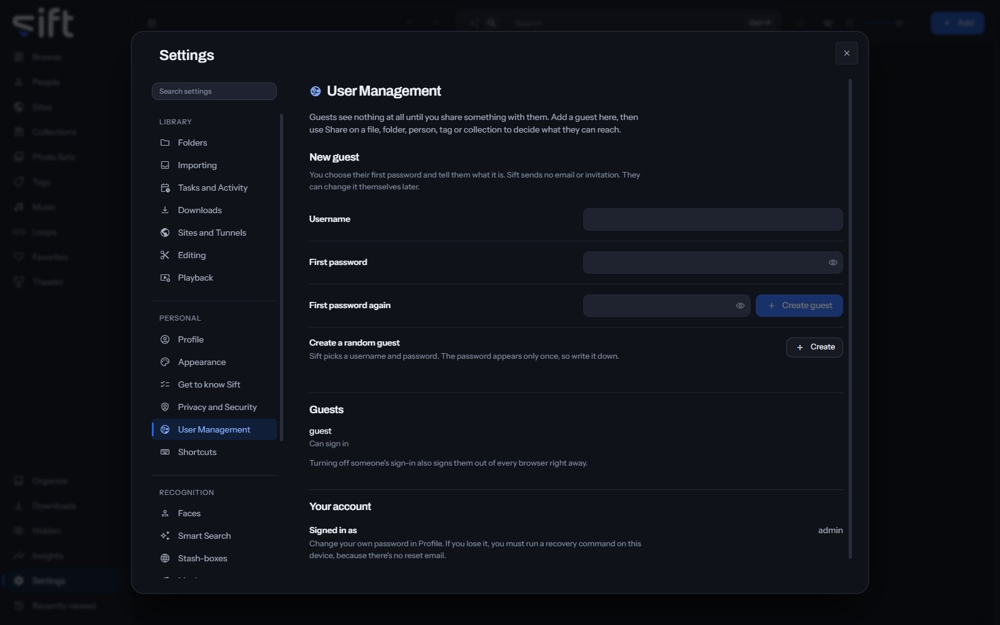

<!-- GENERATED by scripts/docs_generate.py from the settings registry and the client's sections.ts. Edit the source, never this page. -->

User Management is where an admin adds guests and turns their sign-in on or off. To open it, go to [Settings > User Management](/settings/users).

Come here to add a guest. A guest sees nothing until you share something with them, with **Share** on a file, folder, person, tag or collection.

## On this pane

Nothing on this pane is a stored setting. It draws these groups, in this order:

- **New guest**: a **Username** and a **First password**, then **Create guest**. Sift sends no email or invitation, so tell them the password yourself.
- **Create a random guest**: **Create** makes a guest with a username and password Sift picks. The password appears only once.
- **Guests**: one row for each guest, with a switch for whether they can sign in. Turning it off also signs them out of every browser.
- The last group shows your own username. Change your password in [Settings > Profile](/settings/profile#profile.password).

Nothing on this pane is a stored setting: everything on it acts when you press it.
