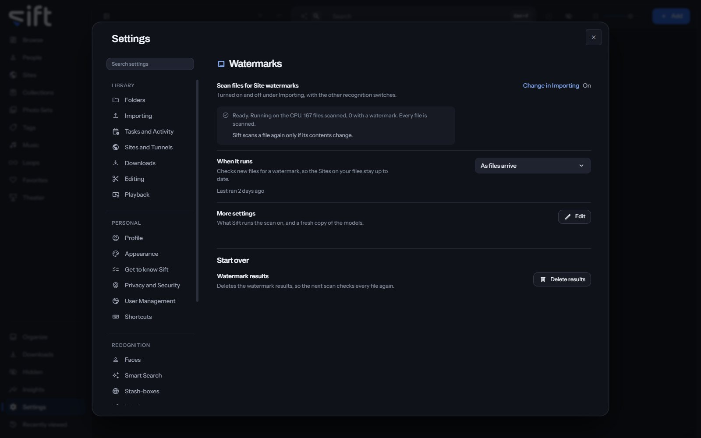

<!-- GENERATED by scripts/docs_generate.py from the settings registry and the client's sections.ts. Edit the source, never this page. -->

Watermarks is where you set up the scan that finds a Site's watermark on your files. To open it, go to [Settings > Watermarks](/settings/watermarks).

Come here to see how many files are scanned, or to choose what the scan runs on. The scan uses the PP-OCRv4 models, on your computer.

## On this pane

The first rows have no heading: the switch, how many files are scanned, when it runs, and **More settings**. The switch is turned on and off in [Settings > Importing](/settings/importing#importing.recognition). Then the pane draws one group:

- **Start over**: delete the watermark results.

## Rows the pane draws by hand

- **More settings**: **Edit** opens what Sift runs the scan on, and a fresh copy of the models. A download that can't connect shows why and what to check. It uses the proxy set in Windows, or in `HTTPS_PROXY`. A proxy set by an automatic configuration script isn't read.
- **Watermark results**: **Delete results** deletes the results, so the next scan checks every file again.

## Every setting

### Scan files for Site watermarks

Finds a Site's watermark printed on a file and adds that Site to the file. A watermark shows where a copy came from, never who is in it.

Sift ships no watermark models. When you choose Download the models, Sift downloads the PP-OCRv4 mobile pair, published by Baidu as part of PaddleOCR, from Hugging Face. The download is about 12 MB. The models recognize the Latin alphabet only, so a watermark in another script isn't found.

- **Path**: [Settings > Watermarks > Scan files for Site watermarks](/settings/watermarks#watermarks.enabled)
- **Default**: Off
- **Who sets it**: an admin, for everyone on this Sift

### Run watermark scans on

A GPU makes a scan about a fifth faster at most, because most of the time goes to opening files.

Sift ships the CPU-only build of its model runtime, so the GPU can't be used until the GPU's own runtime is added. Sift can download it under GPU in [Settings > Performance](/settings/performance). It's about 1.3 GB, downloaded once and stored next to your libraries, so an update doesn't remove it and a new library needs nothing. It needs an NVIDIA GPU and a current driver, and nothing else installed by hand.

- **Path**: [Settings > Watermarks > Run watermark scans on](/settings/watermarks#watermarks.device)
- **Default**: CPU
- **Choices**: CPU, GPU
- **Who sets it**: an admin, for everyone on this Sift
